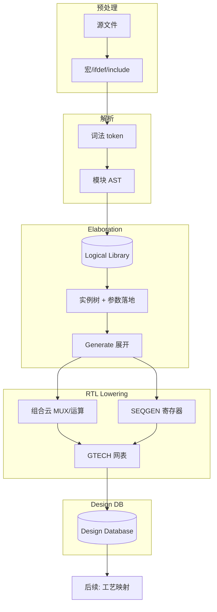

# 2.1 RTL 解析与 Elaboration：综合器内部在做什么

本章从 **逻辑综合器前端（compiler frontend）** 的实现视角，说明 RTL 如何变成内部的 **层次化逻辑网表**。重点不是 Tcl 命令清单，而是：**数据结构、处理阶段、语义决策、以及 RTL 构造如何被 lowering 成通用逻辑（GTECH）**。

不同厂商（Synopsys DC/Fusion、Cadence Genus、Siemens PowerPro 等）的内部命名各异，但架构高度相似：**预处理器 → 解析器 → 语义分析 → Elaboration 引擎 → RTL 解释器（HDL lowering）→ 设计数据库（Design DB）**。

> **范围**：ASIC、标准单元综合；Elaboration 结束时应得到 **与工艺无关的布尔/时序逻辑图**（GTECH 或等价 IR）。工艺映射、时序驱动优化在后续章节。

---

## 1. 综合器整体切片（本章站哪一段）

```text
  RTL 文本
      │
      ▼
┌─────────────────────────────────────────────────────────┐
│  FRONTEND（本章）                                        │
│  预处理 → 词法/语法 → 语义(模块级) → Elaboration        │
│         → RTL→结构 lowering → GTECH 网表写入 Design DB   │
└─────────────────────────────────────────────────────────┘
      │
      ▼
┌─────────────────────────────────────────────────────────┐
│  MIDDLE-END / BACKEND（后续章节）                        │
│  推断细化 → 工艺映射 → 优化 → 约束传播 → 门级网表输出    │
└─────────────────────────────────────────────────────────┘
```

| 用户可见命令（DC） | 主要触发的内部阶段 |
|--------------------|------------------|
| `analyze` | 预处理 + 解析 + **模块级** 语义 → 写入 **逻辑库（logical library）** |
| `elaborate` | Elaboration + RTL lowering + 构建 **当前设计（current design）** |
| `link` | 解析 cell 引用、拼接子设计视图、黑盒绑定 |
| `compile` | 映射 + 优化（已超出本章） |

**关键区分**：

- **Logical library**：存 **未展开** 的 module 模板（parameter 形式参数仍在）。  
- **Design / Working design**：存 **某次 elaboration 的展开结果**（parameter 已落地、generate 已展开），是 GTECH 的载体。

---

## 2. 内部核心数据结构（Design Database）

综合器在内存中维护一张 **异构图（heterogeneous graph）**，仿真器也有类似层次，但综合侧 **二值逻辑、无延时、无 initial 执行**。

### 2.1 对象类型（概念模型）

```text
Design (top)
  └── Cell (instance) ──ref──► Module template / Ref module
         ├── Pin (instance pin) ──connect──► Net
         └── Hierarchical path: "u_cpu/u_alu/add_i"
  Port (module boundary pin)
  Net (single bit or bus owner; 总线 bit 可映射为 bus net / flat net)
```

| 对象 | 含义 | 与 RTL 的对应 |
|------|------|----------------|
| **Module / Ref** | 模块模板 | `module ... endmodule` 分析结果 |
| **Cell** | 一次实例化 | `sub u_sub (...)` |
| **Port** | 模块端口 | `input logic [7:0] a` |
| **Pin** | 实例上的端口连接点 | `u_sub.a` |
| **Net** | 连线 | `assign`、隐式 wire、`logic` 连接 |
| **Bus** | 位向量元数据 | `[31:0]` 的 range、 downto/to |

**总线（bundle）**：Elaboration 后常做 **bus ↔ bit-blast** 两种视图：

- **Bus 保持**：利于调试、报告层次名。  
- **Bit-blast（展开）**：利于某些优化与映射；工具内部可按 pass 切换。

### 2.2 两种“网表”并存

| 层次 | 内容 |
|------|------|
| **RTL 结构网表** | 仍带 `always`、运算符、部分 RTL 原语（未完全 lowering） |
| **GTECH 网表** | 已拆成 **通用门、MUX、加法器、D 触发器模型（SEQGEN）** 等 |

实践上 `elaborate` 末尾或 `compile` 的早期阶段完成 **RTL → GTECH**。下文 **第 7 节** 专讲 lowering。

---

## 3. 阶段 A：预处理（Preprocess）

在词法分析之前，对 **源文件字符流** 做文本级变换：

```text
源文件 → [宏展开 `define] → [条件编译 ifdef] → [include 插入] → 预处理后的 token 流
```

| 机制 | 内部行为 | 综合语义 |
|------|----------|----------|
| `` `include `` | 插入文本，维护 **文件/行号栈** 供报错 | 与 C 类似 |
| `` `define `` | 宏表替换；函数式宏需递归展开保护 | 错误展开可导致 **语法树畸形** |
| `` `ifdef SYNTHESIS `` | 分支 **物理删除** 未选中代码 | 仿真专用块必须在此剔除 |
| `` `default_nettype none`` | 无隐式 net | 未声明即报错，利于 DB 一致 |

**与仿真的差异**：综合预处理 **不执行** `` `timescale `` 的延时语义；`` `timescale `` 主要为仿真/SDF 服务。

**工程要点**：宏未定义导致空行或残留 token，是 Analyze 阶段 **莫名语法错误** 的常见根因。

---

## 4. 阶段 B：词法分析（Lexical Analysis）

将字符流切分为 **token** 序列：

```text
identifier, keyword, operator, number_literal, string, @, always, ...
```

- **SystemVerilog**：需选择 SV 词法（`always_ff`、`` `unique ``、`interface` 等额外 token）。  
- **保留源位置（source trace）**：每个 AST 节点带回 **file:line**，供 `report_timing` 回溯 RTL（通过 `characterize` 或 name mapping）。

内部常使用 **Flex/手写 lexer + LRM 关键字表**；错误恢复策略因工具而异（多数在严重语法错误时停止当前文件 analyze）。

---

## 5. 阶段 C：语法分析（Parse）与 AST

### 5.1 抽象语法树（AST）

Parser（常为 LALR/递归下降）为 **每个编译单元** 生成 AST，典型节点类型：

| AST 节点（概念） | RTL 来源 |
|------------------|----------|
| `ModuleDecl` | `module` 头、端口列表、参数列表 |
| `AlwaysConstruct` | `always_comb` / `always_ff` / `always` |
| `AssignStmt` | `assign` |
| `InstanceDecl` | 子模块例化 |
| `GenerateBlock` | `generate` / `for` / `if` |
| `Expr` 子树 | 运算符、拼接、函数调用 |

**Analyze 阶段结束**时：每个 `module` 在 logical library 中有一条 **未 elaborated 的模板**，AST 仍挂在该模板上。

### 5.2 单文件 vs 设计库

```text
Logical Library
  ├── module uart_tx   (AST + local symbol table)
  ├── module cpu_core
  └── package bus_pkg
```

- **跨模块引用**（例化 `uart_tx`）在 analyze 时仅 **登记引用名**，不检查子模块是否已存在（可能稍后 analyze）。  
- **Package**：analyze 时解析 `typedef`、`function` 声明，供 import 解析。

---

## 6. 阶段 D：模块级语义分析（Semantic Analysis, pre-elab）

在 **单个 module 模板** 内完成的检查与符号绑定：

| 任务 | 说明 |
|------|------|
| **符号表构建** | 端口、`wire`/`logic`、变量、`parameter`、genvar、内部 function |
| **作用域规则** | `begin-end` 块、generate 子作用域 |
| **类型/位宽推断** | 表达式 **self-determined** vs **context-determined** 位宽（Verilog 规则） |
| **枚举、struct** | SV：`enum` 基底类型、 `packed struct` 布局 |
| **函数/任务** | 可综合子集检查（无延时、无动态数组） |
| **连续赋值与过程块冲突** | 同一变量多驱动 **登记为错误** |

**故意推迟到 elaboration 的决策**：

- `parameter` 依赖链的最终数值（若依赖顶层覆盖）。  
- `generate` 循环次数（上界来自 parameter）。  
- 层次路径名、位宽依赖 parameter 的端口。

---

## 7. 阶段 E：Elaboration 引擎（核心）

Elaboration 是 **从模板实例化出一棵唯一的、常量化的设计树** 的过程。可理解为：**把“类”（module）实例化成“对象”（cell tree）**。

### 7.1 算法骨架（自顶向下）

```text
elaborate(top):
  1. 查找 logical library 中的 module top
  2. 创建 Design 对象，设 current_design
  3. 对 top 调用 elaborate_module(top, param_overrides)
  4. link：解析所有 cell→ref，连接 floating ref
  5. 触发 RTL lowering（或推迟到 compile 早期）
```

```text
elaborate_module(M, params):
  1. 计算 M 的 parameter 字典（含 defparam、#() 覆盖）
  2. 常量折叠：localparam、generate 条件
  3. 展开 generate 块 → 产生 0..N 个子 cell / 子 net
  4. 对 M 内每条实例化 stmt：
        创建 Cell，绑定 Port→Pin→Net
  5. 对 M 内 always/assign：
        登记到“待 lowering 队列”或立即建网（工具差异）
  6. 递归 elaborate_module(子模块, 子参数)
```

### 7.2 Parameter 求值

- 形成 **有向无环图（DAG）**：`parameter B = A+1; parameter A = 1;` 需拓扑求值。  
- **非法循环依赖** → elaboration error。  
- 求值在 **整数/位向量抽象域** 完成（综合不用浮点 parameter）。

### 7.3 Generate 展开

| 构造 | 展开结果 |
|------|----------|
| `generate for` | N 个 **独立 cell**，层次名 `slice[3]` |
| `generate if` | 选中分支内的实例 |
| `generate case` | 与 if 类似 |

**实例路径（instance path）** 成为后续 **SDC `get_cells`、调试命名** 的基础。  
展开后 **genvar 消失**，只剩具体 cell。

### 7.4 端口连接（Port Binding）

例化 `sub u (.a(x), .b(y))` 时：

1. 按名/按位解析 formal → actual。  
2. **位宽对齐规则**（Verilog LRM）：无符号扩展、截断、拼接。  
3. 在 DB 中创建 **pin-net 连接**；未连接 input 可能 tie 0/1 或 **警告/错误**（由 `set_app_var` 控制）。

**类型检查**：`output` 不能驱动 `output`；`inout` 需 resolve 三态（综合常限制三态用法）。

### 7.5 常量传播（Constant Propagation）

在 elaboration 或紧随其后的 pass：

- `assign y = 8'hFF & 8'h0F` → `y = 8'h0F` 可能 **直接折叠** 为 tie。  
- `if (1'b0) ...` 分支 **死代码消除（DCE）**。  
- 为 generate `if (PARAM==0)` 提供 **编译期分支选择**。

这是 **前端优化**，与后端 `compile_ultra` 的时序优化不同。

---

## 8. 阶段 F：RTL → 结构 Lowering（RTL Interpretation）

这是综合器 **最“像编译器”** 的一步：把 **过程式 RTL** 变成 **纯结构网表**。仿真器 **不** 做此步（或仅在 force 等特殊场景）。

### 8.1 `assign` 与连续逻辑

```verilog
assign y = (a & b) | c;
```

直接 lowering 为：

```text
GTECH_AND → GTECH_OR → net y
```

表达式树：**深度优先** 建立运算符节点；公共子表达式 **可能** 被 CSE（公共子表达式消除）合并（多在后期优化）。

### 8.2 `always_comb` / 组合 `always`

**目标**：得到 **无状态** 的组合逻辑云；语义上等价于 **零延时**、对敏感列表所有输入变化的响应。

内部典型步骤：

```text
1. 分析敏感列表（@* 或 always_comb 隐式全集）
2. 将 if/case 链转为 MUX 树（priority MUX vs parallel MUX 取决于 unique/priority）
3. 阻塞赋值 '=' ：按语句顺序构建数据依赖（模拟软件顺序）
4. 检查所有输出在所有分支是否被赋值 → 否则标记 LATCH_INFER
5. 删除悬空临时变量，输出连到 module port / 内部 net
```

**不完整 `if` 与 latch**：

```verilog
always_comb
  if (en) q = d;   // 缺 else → 工具推断电平敏感锁存器（latch）
```

内部：为 `q` 保留 **反馈路径**（MUX：en 选 d，否则选 q 旧值），映射为 **GTECH_LAT** 或在后续映射为 latch 单元。

### 8.3 `always_ff` / 时序 `always`

**目标**：识别 **时钟、复位、使能、次态输入**，生成 **顺序元件抽象（SEQGEN）**。

```verilog
always_ff @(posedge clk or negedge rst_n)
  if (!rst_n) q <= 0;
  else if (en) q <= d;
```

Lowering 结果（概念上）：

```text
GTECH_SEQGEN (或 DFF 抽象)
  .CLK(clk)
  .CLR_N(rst_n)      // 异步复位：敏感列表含 negedge rst_n
  .EN(en)
  .D(d)
  .Q(q)
```

| RTL 特征 | 内部识别 |
|----------|----------|
| 敏感列表仅 `posedge clk` | 同步复位/无异步复位 |
| 含 `negedge rst_n` | 异步复位 pin |
| 多 `always` 写同一 `q` | **多驱动错误** 或禁止 |
| 非阻塞 `<=` | 每个时钟沿更新；块内顺序不改变本周期语义 |

**异步复位同步释放**：RTL 常是 **两级寄存器 + 组合逻辑**；elaboration **不自动插入**，由设计提供；工具只在网表中看到具体 DFF 结构。

### 8.4 `case` 与 `unique` / `priority`

| SV 修饰 | Lowering 倾向 |
|---------|----------------|
| `unique case` | **并行 MUX**（互斥假设，利于面积/延时） |
| `priority case` | **级联 MUX 链**（与 if-else-if 类似） |
| 无修饰 | 工具默认启发式 + Lint |

### 8.5 运算符与资源推断（elaboration 末期 / compile 早期）

| RTL 运算 | GTECH 原语（概念） | 备注 |
|----------|-------------------|------|
| `+` `-` | GTECH_ADD, GTECH_SUB | 位宽扩展规则影响符号 |
| `*` | GTECH_MULT | 未映射前为 **抽象乘法器** |
| `<<` `>>` | GTECH_SHIFTER / 布线 | 常数移位 → 重连线 |
| 比较 | GTECH_CMP | 可能拆成 XOR+OR 树 |
| 拼接 `{}` | BUS_CONNECT / CONCAT | 无逻辑 |

**RAM / ROM**：多端口读写模式在 lowering 后形成 **GTECH_RAM** 或寄存器阵列；是否映射到 SRAM 宏在 **mapping 阶段**（见推断章节）。

---

## 9. GTECH：通用工艺中间表示

GTECH 是 **与 Foundry 无关** 的原语集合，充当 **RTL 与 .lib 标准单元** 之间的 IR。

```text
        RTL 构造              GTECH 层              映射后
   always_ff + <=    →    GTECH_SEQGEN/DFF    →    DFFRX1 (来自 .lib)
   a * b             →    GTECH_MULT          →    DW02_mult / 门级阵列
   unique case       →    GTECH_MUX 树        →    MUX2X1 级联
```

**为何需要 GTECH**：

1. **一次 lowering**，多次映射（不同 corner、不同工艺试算）。  
2. 优化 pass 在 **技术无关** 层做结构化简（如 MUX 树平衡）。  
3. 与 **形式验证、功耗分析** 工具交换同一抽象层。

**用户不可见**：GTECH 单元名通常不出现在最终 Verilog 网表，但可在 `compile -stage` 或 GUI 中查看。

---

## 10. Link、Uniquify、黑盒

### 10.1 Link

- 将 cell 的 **ref 指针** 绑定到 logical library 中的 module。  
- 若 ref 缺失 → **unresolved reference**。  
- **黑盒**：ref 存在但无内部网表，仅 port；mapping 时用 **interface timing** 或 **dont_touch**。

### 10.2 Uniquify（唯一化）

同一 module 模板被例化多次，若 **parameter 或 generate 结果不同**，需 **uniquify** 为多个 ref 变体（`cpu_0`、`cpu_1` 内部网表不同）。

```text
module ram #(parameter W=8) ...  // 一次例化 W=8，一次 W=16
→ 逻辑库中 ram_W8, ram_W16 两个 elaborated ref
```

否则 **参数化模板** 无法共享同一张网表。

---

## 11. 与仿真 Elaboration 的语义差

| 维度 | 仿真器 | 综合器 |
|------|--------|--------|
| 值域 | 4-state (0,1,X,Z) | 2-state（X 仅 Lint） |
| `initial` | 执行 | 忽略或报错 |
| `#delay` | 调度事件 | 非法/忽略 |
| NBA 调度 | 严格 LRM | 用于推断寄存器，非周期仿真 |
| `force` | 支持 | 不支持 |
| 时序检查 | `$setup` 等 | 无；改用 STA |

**同一 RTL 仿真通过 ≠ 综合语义正确**（典型：仿真靠 X 暴露 bug，综合静默优化错误逻辑）。

---

## 12. 检查 Pass：在 DB 上遍历

`check_design` 等对 **已建 Design DB** 做一致性遍历：

| 检查 | 图算法/规则 |
|------|-------------|
| 浮空 net | net 无 driver 或 无 load |
| 多驱动 | 同一 net 多个 active driver |
| 组合环 | 组合逻辑 SCC（强连通分量）有环 |
| 悬空 pin | 未连接 port |
| 电源/地 | 未 tie 的 supply（若启用 low power） |

**Latch 报告**：在 lowering 后标记 **电平敏感反馈** 节点。

---

## 13. 端到端数据流（一图）



---

## 14. 从 RTL 写法到内部对象的映射表

| 你的 RTL | Elaboration 后 DB 中大致对应 |
|----------|------------------------------|
| `module` | `Ref` + 可选 `Design` 视图 |
| `sub u()` | `Cell u` → `Ref sub` |
| `logic [3:0] n` | `Net` + bus range |
| `assign` | `GTECH_*` 驱动 `n` |
| `always_comb` | MUX/逻辑云，无 SEQGEN |
| `always_ff` | `GTECH_SEQGEN` / DFF 抽象 |
| `parameter` | 已折叠为常数，不在网表 |
| `generate` | 多个 `Cell`，无 generate 节点 |
| `` `ifdef `` | 不存在未选中分支 |

详见 [01-rtl](../01-rtl/) 各章。

---

## 15. 调试：当内部行为与预期不符

| 现象 | 从内部机制推断可能原因 |
|------|------------------------|
| 多驱动 | 两个 `assign` 或 `always` 驱动同一 `logic` |
| Latch 推断 | 组合块分支不完整 |
| 位宽警告 | context-determined 扩展与截断 |
| 子模块找不到 | analyze 顺序 / 库名 / `link` 失败 |
| 层次名不对 | `hdlin_enable_hier_naming`、generate 标签 |
| 与仿真不一致 | X、NBA 顺序、仿真专用块未被 `ifdef` 剔除 |

**查看内部网表**（辅助手段，非本章重点）：

```tcl
# DC：仅作阶段检查示例
compile -stage elaborate
report_cell -connections
write -format verilog -hierarchy -output post_elab.v
```

---

## 16. 附录：命令与内部阶段对照（简表）

| 命令（DC） | 内部主要效果 |
|------------|----------------|
| `analyze` | AST → logical library |
| `elaborate` | 实例树 + lowering → GTECH in Design DB |
| `link` | ref 绑定 |
| `check_design` | DB 一致性扫描 |
| `compile` | GTECH → .lib 单元 + 优化 |

Genus：`read_hdl` ≈ analyze；`elaborate` 同上。

---

## 17. 小结

| 你要记住的内部概念 |
|--------------------|
| **Logical library** 存模板；**Design DB** 存一次展开后的网表 |
| **Elaboration** = 参数化实例化 + generate 展开 + 连接关系 |
| **RTL lowering** = `always`/`assign` → GTECH 组合云与 SEQGEN |
| **Latch/多驱动/环** 在 lowering 与 check 阶段暴露 |
| **GTECH** 是工艺无关 IR，映射发生在后端 |

---

## 下一节

- [02 推断：寄存器、锁存器、RAM、乘法器](./02-inference.md)（待写：在 GTECH 之上如何识别与绑定工艺单元）
- [00 逻辑综合总览](./00-synthesis-overview.md)
