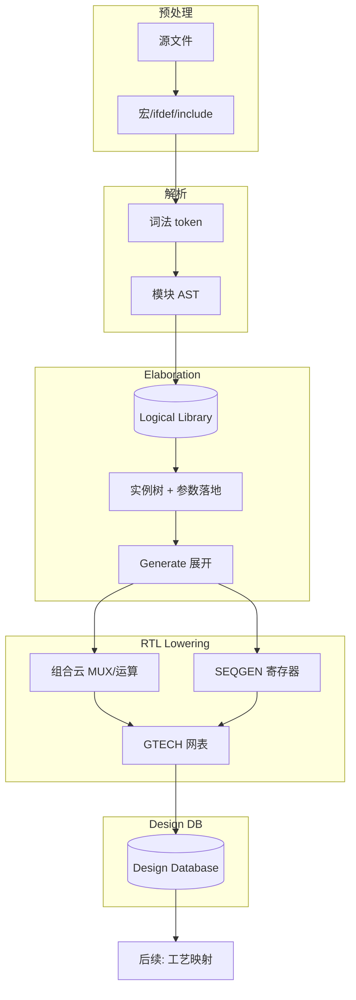

# 2.1 RTL 解析与 Elaboration：综合器内部在做什么

> **本章回答**：RTL 如何变成 GTECH 与 Design DB。
> **读完应能**：① 说清 elaborate 各子阶段 ② 区分 AST/GTECH/SEQGEN ③ 知道仿真与综合语义差
> **先修**：Verilog 可综合子集 · **难度**：★★★☆☆ · **walkthrough**：[elab_walkthrough](./examples/elab_walkthrough/)

本章从 **逻辑综合器前端（compiler frontend）** 的实现视角，说明 RTL 如何变成内部的 **层次化逻辑网表**。重点不是 Tcl 命令清单，而是：**数据结构、处理阶段、语义决策、以及 RTL 构造如何被 lowering 成通用逻辑（GTECH）**。

**阅读方式**：全章用 **同一份案例**（[`top.sv`](./examples/elab_walkthrough/top.sv) + [`child.sv`](./examples/elab_walkthrough/child.sv)，`N=2,W=8`）串联。**§2** 按步骤写清「做什么 → 生成什么」；**§4–§13** 各阶段机制节开头均有 **「本案例」表**，与 §2 逐步对应。

不同厂商（Synopsys DC/Fusion、Cadence Genus、Siemens PowerPro 等）的内部命名各异，但架构高度相似：**预处理器 → 解析器 → 语义分析 → Elaboration 引擎 → RTL 解释器（HDL lowering）→ 设计数据库（Design DB）**。

> **范围**：ASIC、标准单元综合；Elaboration 结束时应得到 **与工艺无关的布尔/时序逻辑图**（GTECH 或等价 IR）。工艺映射、时序驱动优化在后续章节。

---

## 1. 综合器整体切片（本章站哪一段）
> **一句话**：综合器整体切片（本章站哪一段）——本章核心机制点。

```text
  RTL 文本
      │
      ▼
┌─────────────────────────────────────────────────────────┐
│  FRONTEND（本章）                                        │
│  预处理 → 词法/语法 → 语义(模块级) → Elaboration        │
│         → RTL→结构 lowering → GTECH 网表写入 Design DB   │
└─────────────────────────────────────────────────────────┘
      │
      ▼
┌─────────────────────────────────────────────────────────┐
│  MIDDLE-END / BACKEND（后续章节）                        │
│  推断 → AIG 布尔优化 → 工艺映射 → 时序驱动优化 → 网表输出 │
└─────────────────────────────────────────────────────────┘
```

| 用户可见阶段（概念） | 主要触发的内部 pass |
|--------------------|-------------------|
| 前端读入 | 预处理 + 解析 + **模块级** 语义 → **logical library** |
| Elaboration | 参数/generate 展开 + RTL lowering → **Design DB** |
| Link | 解析 cell 引用、拼接子设计视图、黑盒绑定 |
| Compile | 推断 → AIG → 映射 → TDO（后续章节） |

**关键区分**：

- **Logical library**：存 **未展开** 的 module 模板（parameter 形式参数仍在）。  
- **Design / Working design**：存 **某次 elaboration 的展开结果**（parameter 已落地、generate 已展开），是 GTECH 的载体。

**贯穿示例 RTL**（`examples/elab_walkthrough/`）：`child.sv`、`top.sv`。

> **推荐阅读顺序**：先通读 **[§2 完整案例走读](#2-完整案例走读top--child一条龙)**（同一份 RTL 按阶段看「处理了啥 → 变成了啥」），再按需翻阅 §3 数据结构、§4–§12 各阶段机制细节。阶段 IR 对照见 [elab_walkthrough/README.md](./examples/elab_walkthrough/README.md)。

### 各阶段输入/输出一览（速查）

| 阶段 | 输入（概念） | 输出（概念） |
|------|----------------|----------------|
| A 预处理 | 带宏的源文本 | 单份「干净」字符流 |
| B 词法 | 字符流 | Token 序列 |
| C 语法 | Token 流 | 模块级 AST → logical library |
| D 语义 | AST + 符号表 | 符号表 / 语义错误 |
| E Elaboration | 顶层 + 参数覆盖 | 实例树 + Net/Pin |
| F Lowering | always/assign | GTECH 单元 + 连接 |
| G GTECH | 结构网表 | 工艺无关 IR |
| Link / Uniquify | cell-ref | 解析后的 Design DB |
| Check | Design DB | 错误/警告报告 |

---


## 2. 完整案例走读：top + child（一条龙）

> **案例文件**：[`top.sv`](./examples/elab_walkthrough/top.sv) + [`child.sv`](./examples/elab_walkthrough/child.sv)  
> **参数**：`N=2`，`W=8`（`elaborate top` 时无额外覆盖）  
> **目标**：用 **同一份设计**，按综合器 **真实执行顺序**，逐步说明每步 **输入是什么、内部做了什么、输出长什么样**。

### 2.0 起点：源 RTL

**child.sv**（子模块 — 参数化位宽 + 寄存器打拍）：

```systemverilog
module child #(
    parameter int W = 8
) (
    input  logic             clk,
    input  logic [W-1:0]     din,
    output logic [W-1:0]     dout
);
    always_ff @(posedge clk) begin
        dout <= din;
    end
endmodule
```

**top.sv**（顶层 — generate 例化 + 故意不完整的组合块）：

```systemverilog
module top #(
    parameter int N = 2,
    parameter int W = 8
) (
    input  logic             clk,
    input  logic             en,
    input  logic [W-1:0]     data_in,
    output logic [W-1:0]     data_out
);
    logic [W-1:0] sum;

    generate
        for (genvar i = 0; i < N; i++) begin : g_slice
            child #(.W(W)) u_child (
                .clk  (clk),
                .din  (data_in),
                .dout (sum)          // 两路寄存器输出接到同一 net
            );
        end
    endgenerate

    always_comb begin
        if (en)
            data_out = sum;
        // 故意缺 else：用于演示 latch 推断
    end
endmodule
```

此时还只是 **磁盘上的文本**；综合器内存里 **尚无** Design DB。

---

### 2.1 全流程总表（先建立地图）

| 步骤 | 阶段 | 本步做什么 | 本步生成什么 | 此步结束后内存里有什么 | 机制详解 |
|:----:|------|------------|--------------|------------------------|----------|
| 0 | 读入 | 打开 `top.sv`、`child.sv` | 按文件的 **字符流** | 仅文本，无 DB | — |
| A | 预处理 | 宏/`ifdef`/`include` 文本变换 | 本案例：**文本不变** | 仍仅文本 | [§4](#4-阶段-a预处理preprocess) |
| B | 词法 | 字符 → **token** | 带 `file:line` 的 token 链 | token 序列，**无 AST** | [§5](#5-阶段-b词法分析lexical-analysis) |
| C | 语法 | token → **AST** | `worklib.top`、`worklib.child` 模板 | **logical library**（2 个 AST） | [§6](#6-阶段-c语法分析parse与-ast) |
| D | 语义 | 模块内符号/位宽检查 | 符号表；本案例 **无 ERROR** | logical library + 符号表，**无 Cell** | [§7](#7-阶段-d模块级语义分析semantic-analysis-pre-elab) |
| E | Elaboration | 参数、`generate`、例化、连线 | **Design DB** 实例树 + Net/Pin | 异构图 DB；**尚无 GTECH 门** | [§8](#8-阶段-eelaboration-引擎核心) |
| F | Lowering | 解释 `always` 行为 | `16×GTECH_FD1` + `data_out` 上 LAT | DB + **GTECH 节点** | [§9](#9-阶段-frtl--结构-loweringrtl-interpretation) |
| G | GTECH 定型 | 统一命名与属性 | 完整 **工艺无关 IR** | 可送 02 推断 / 04 映射的网表 | [§10](#10-gtech通用工艺中间表示) |
| H | Link | 绑定 Cell→module ref | `u_child.ref → child(W=8)` | DB + 解析后的 ref 边 | [§11](#11-linkuniquify黑盒) |
| I | Check | 遍历 DB 查违例 | **报告**：`sum` 多驱动 ERROR + latch Warning | DB 不变；多 **文本报告** | [§13](#13-检查-pass在-db-上遍历) |

```text
  top.sv + child.sv（文本）
      │ A 预处理（本案例：跳过）
      ▼
  Token 流 ── B 词法
      ▼
  logical library: AST(top), AST(child) ── C 语法 + D 语义
      ▼
  Design DB: 2×child 实例 + sum 多驱动 ── E Elaboration
      ▼
  GTECH: 16×FD + data_out 上 LAT ── F Lowering
      ▼
  check_design: ERROR on sum ── I Check
      ▼
  （下一章 02 推断：latch 标签、寄存器属性）
```

---

### 2.2 步骤 A：预处理（Preprocess）

| | |
|--|--|
| **输入** | `top.sv`、`child.sv` 原始文本 |
| **内部动作** | 宏展开、`` `ifdef `` 分支删除、`` `include `` 插入 |
| **本案例输出** | **与输入相同**（两文件均无预处理指令） |

若改用 [`preprocess_demo.sv`](./examples/elab_walkthrough/preprocess_demo.sv)（含 `` `ifdef SYNTHESIS ``），则 `initial` 分支会被 **物理删除**，字符流里只剩 `assign` — 见 [§4 案例](./01-rtl-parsing-and-elaboration.md#输入输出案例-41)。

---

### 2.3 步骤 B：词法（Lex）

| | |
|--|--|
| **输入** | 预处理后的字符流 |
| **内部动作** | 识别 `module`、`always_ff`、`generate`、`for` 等 token；记录源位置 |
| **本案例输出** | Token 链（片段示意） |

`child.sv` 中 `always_ff` 一行：

```text
TK_ALWAYS_FF  TK_AT  TK_POSEDGE  TK_ID(clk)  TK_ID(dout)  TK_LE  TK_ID(din)  TK_SEMI
```

`top.sv` 中 generate 头：

```text
TK_GENERATE  TK_FOR  TK_LPAREN  TK_ID(genvar)  TK_ID(i)  TK_EQ  TK_NUM(0)  ...
```

---

### 2.4 步骤 C：语法（Parse）→ logical library

| | |
|--|--|
| **输入** | Token 流 |
| **内部动作** | Parser 为每个 `module` 建 AST，写入 **logical library**（模板库，**未展开**） |
| **本案例输出** | 库中有两个 module 模板，**尚无 Cell、尚无 g_slice[0]** |

```text
worklib.child  →  ModuleDecl(child)
                   ├── ParamDecl: W = 8
                   ├── Port: clk, din[W-1:0], dout[W-1:0]
                   └── AlwaysFF → NBA(dout <= din)

worklib.top    →  ModuleDecl(top)
                   ├── ParamDecl: N=2, W=8
                   ├── Port: clk, en, data_in, data_out
                   ├── GenerateFor(i, 0..N-1) → Instance(child, u_child)
                   └── AlwaysComb → If(en) → Assign(data_out, sum)
```

**此时状态**：知道「top 里有个 for-generate 要例化 child」，但 **循环还没展开**，`N` 仍可能是形式参数。

---

### 2.5 步骤 D：模块级语义（Semantic, pre-elab）

| | |
|--|--|
| **输入** | 各 module 的 AST |
| **内部动作** | 建符号表；检查端口/变量冲突、可综合子集、同模块内多驱动 |
| **本案例输出** | `child`、`top` 各自符号表合法；**generate 次数、实例路径仍未确定** |

本案例中 **不会** 在此步报 `sum` 多驱动 — 因为 generate 尚未展开，两个 `u_child` 的 `dout` 还没接到同一根 `sum` 上。

---

### 2.6 步骤 E：Elaboration — 展开成 Design DB

| | |
|--|--|
| **输入** | 顶层名 `top` + 参数（默认 `N=2, W=8`） |
| **内部动作** | 参数求值 → 展开 generate → 创建 Cell/Pin/Net → 递归子模块 |
| **本案例输出** | 一张 **异构图**（见 [§3](#3-内部核心数据结构design-database)）：实例树 + 连接关系 |

**E.1 参数落地**

```text
top.N = 2    top.W = 8    child.W = 8（每次例化）
```

**E.2 Generate 展开**（`for (i=0; i<2; i++)` → 2 份独立实例）

```text
Design: top
├── Cell  g_slice[0].u_child  ──ref──►  child(W=8)
└── Cell  g_slice[1].u_child  ──ref──►  child(W=8)
```

**E.3 端口连接（Pin → Net）**

```text
Net  clk, en, data_in[7:0], sum[7:0], data_out[7:0]

g_slice[0].u_child:  .clk→clk  .din→data_in  .dout→sum
g_slice[1].u_child:  .clk→clk  .din→data_in  .dout→sum   ← 与 [0] 同网
```

**E.4 尚未 lowering 的行为块**

`always_ff` / `always_comb` 此时通常进入 **待 lowering 队列**（或部分工具立即建网）；DB 里已能看到 **Pin 已接到 Net**，但 `dout` 的 **驱动逻辑** 还不是 GTECH 门。

**本案例关键点**：两路 `child` 的 `dout` 都驱动 `sum` → 为后续 **check_design 多驱动** 埋下伏笔（RTL 需修：只保留一个 child，或加 mux/加法树）。

---

### 2.7 步骤 F：Lowering — RTL 行为 → GTECH

| | |
|--|--|
| **输入** | Elaboration 后的 Design DB + 待解释的 `always`/`assign` |
| **内部动作** | 组合块 → MUX/逻辑云；时序块 → SEQGEN；不完整分支 → latch 候选 |
| **本案例输出** | GTECH 原语挂到同一 Design DB |

**F.1 child：`always_ff` → 寄存器原语**

```systemverilog
always_ff @(posedge clk) dout <= din;
```

```text
8 × GTECH_FD1（或 1 个 bus-FF 壳）:
  .CK(clk)  .D(din[i])  .Q(dout[i])   i = 0..7
```

**F.2 top：`always_comb` 缺 else → latch**

```systemverilog
always_comb begin
    if (en) data_out = sum;
end
```

```text
GTECH_LAT / 反馈 MUX 候选:
  en=1 → data_out 跟随 sum
  en=0 → data_out 保持旧值（电平敏感反馈）
Lint: Inferred latch on data_out
```

若补上 `else data_out = '0;`，则变为 **纯 MUX + 常数**，无 latch — 对比见 [§9.2](./01-rtl-parsing-and-elaboration.md#92-always_comb--组合-always)。

**F.3 本案例 lowering 后逻辑结构（概念图）**

```text
                    data_in[7:0]
                         │
            ┌────────────┴────────────┐
            ▼                         ▼
    g_slice[0].u_child          g_slice[1].u_child
    (8× GTECH_FD1)              (8× GTECH_FD1)
            │                         │
            └────────────┬────────────┘
                         ▼
                    sum[7:0]  ← 双驱动（结构错误）
                         │
                    (LAT/MUX)
                         ▼
                   data_out[7:0]
```

---

### 2.8 步骤 G：GTECH 网表就绪

| | |
|--|--|
| **输入** | Lowering 完成的结构 + 行为 |
| **内部动作** | 统一 GTECH 命名、bus 视图、SEQGEN 属性 |
| **本案例输出** | 工艺无关 IR；**尚无** `.lib` 里的 `DFFRX1` |

导出 post-elab 网表片段（名称因工具而异）：

```verilog
// child 内每一位（共 8 个）
GTECH_FD1 u_dout_0 ( .CK(clk), .D(din[0]), .Q(/* 连到 sum[0] */) );
// top 组合部分
GTECH_LAT u_data_out_latch ( ... );   // 或 GTECH_MUX 反馈结构
```

---

### 2.9 步骤 H：Link

| | |
|--|--|
| **输入** | Cell 上的 ref 名 `child` |
| **内部动作** | 在 logical library 中查找定义，绑定 ref 边 |
| **本案例输出** | 两实例均解析成功 |

```text
g_slice[0].u_child.ref → worklib.child(W=8)   ✓
g_slice[1].u_child.ref → worklib.child(W=8)   ✓
```

若 `analyze` 漏读 `child.sv` → `Error: reference 'child' not found`。

---

### 2.10 步骤 I：check_design

| | |
|--|--|
| **输入** | 完整 Design DB |
| **内部动作** | 图遍历：多驱动、浮空、组合环、悬空 pin |
| **本案例输出** | **至少一条 ERROR** + latch 警告 |

```text
Error (MULTIPLE_DRIVERS): net sum[*] driven by
  top/g_slice[0].u_child/dout  AND  top/g_slice[1].u_child/dout

Warning: Inferred latch on top/data_out
```

| 问题 | 根因（对应走读步骤） | RTL 修复方向 |
|------|----------------------|--------------|
| `sum` 多驱动 | 步骤 E.3：两 child 同接 `sum` | 只例化一个 child，或改为 `sum = a + b` 等合法结构 |
| `data_out` latch | 步骤 F.2：`always_comb` 无 else | 补 `else` 或改 `always_ff` |

**修复前**：综合链通常 **在此卡住** 或带错继续（取决于工具策略）。**修复后** 才可进入 [02 推断](./02-inference.md) → [03 AIG](./03-optimization.md)。

---

### 2.11 同一语句在各步的「形态」对照

以 `child` 内 `dout <= din` 为例（单 bit 视角）：

| 步骤 | `dout <= din` 长什么样 |
|------|------------------------|
| A 预处理 | 源文本一行 |
| C AST | `AlwaysFF` 节点 + `NBA(dout, din)` |
| E Elaboration | `Pin Q(dout)`、`Pin D(din)` 已连到 net，**尚无触发器单元** |
| F Lowering | `GTECH_FD1`：`.CK(clk) .D(din) .Q(dout)` |
| 04 映射（下章） | `DFFRX1`（来自工艺库） |

以 `top` 内 `if (en) data_out = sum` 为例：

| 步骤 | 长什么样 |
|------|----------|
| C AST | `AlwaysComb` + `If(en)` + 阻塞赋 |
| E Elaboration | `data_out`、`sum` 均为 net，**行为未解释** |
| F Lowering | `GTECH_LAT` 或反馈 MUX + **Lint** |
| 02 推断 | `data_out` 标记为 **latch** 资源（若未修 RTL） |

---

### 2.12 逐步累积：同一案例 IR 快照（一表串全程）

| 步骤 | 本步输入（上一歩产物） | 本步输出（本步新生成） | 关键可见对象（本案例） |
|:----:|------------------------|------------------------|------------------------|
| 0 | — | 源文本 | `module top` / `module child` 字符串 |
| A | 源文本 | 预处理后文本（同 0） | 无宏；`initial` 不存在 |
| B | 文本 | Token 链 | `TK_ALWAYS_FF`、`TK_GENERATE`… |
| C | Token | AST 模板 ×2 | `GenerateFor(N)` 未展开；`AlwaysFF(dout<=din)` |
| D | AST | 符号表 | `top.sum` 声明为 net；**尚无** `g_slice[0]` |
| E | 符号表+库 | Design DB | `g_slice[0/1].u_child`；`sum` 双驱动连接已建立 |
| F | DB+行为队列 | GTECH 节点 | `GTECH_FD1×16`；`GTECH_LAT(data_out)` |
| G | GTECH 片段 | 定型 IR | post-elab 网表可导出；无 `DFFRX1` |
| H | IR | ref 绑定 | `u_child → child(W=8)` ✓×2 |
| I | 完整 DB | check 报告 | `MULTIPLE_DRIVERS(sum)`；`latch(data_out)` |

---

### 2.13 读完走读后：细节去哪里查

| 你想深挖 | 跳转 |
|----------|------|
| Design DB 对象类型、异构图 | [§3](#3-内部核心数据结构design-database) |
| 预处理 / 词法 / 语法 / 语义 | [§4–§7](#4-阶段-a预处理preprocess) |
| Elaboration 算法、generate、端口绑定 | [§8](#8-阶段-eelaboration-引擎核心) |
| always、case、运算符 lowering | [§9](#9-阶段-frtl--结构-loweringrtl-interpretation) |
| 仿真 vs 综合差异 | [§12](#12-与仿真-elaboration-的语义差) |
| 全链到映射 | [mini_chain](./examples/mini_chain/README.md) |

---

## 3. 内部核心数据结构（Design Database）
> **一句话**：内部核心数据结构（Design Database）——本章核心机制点。实例见 [§2 步骤 E](#26-步骤-eelaboration--展开成-design-db)。

### 本案例（top + child）— 步骤 E 产物长什么样

> 步骤 E 完整展开见 [§2.6](#26-步骤-eelaboration--展开成-design-db)；此处解释 **Design DB 对象** 在本案例中的含义。

| DB 对象 | 本案例中对应什么 |
|---------|------------------|
| `Design: top` | 一次 `elaborate top` 的展开结果 |
| `Cell g_slice[0].u_child` | `generate` 第 0 次迭代例化的 `child` |
| `Net sum[7:0]` | 两路 `child.dout` 均连接于此 → 步骤 I 多驱动 |
| `Pin` | 如 `g_slice[0].u_child/dout` → `sum` |


综合器在内存中维护一张 **异构图（heterogeneous graph）**，仿真器也有类似层次，但综合侧 **二值逻辑、无延时、无 initial 执行**。

### 3.1 对象类型（概念模型）

```text
Design (top)
  └── Cell (instance) ──ref──► Module template / Ref module
         ├── Pin (instance pin) ──connect──► Net
         └── Hierarchical path: "u_cpu/u_alu/add_i"
  Port (module boundary pin)
  Net (single bit or bus owner; 总线 bit 可映射为 bus net / flat net)
```

| 对象 | 含义 | 与 RTL 的对应 |
|------|------|----------------|
| **Module / Ref** | 模块模板 | `module ... endmodule` 分析结果 |
| **Cell** | 一次实例化 | `sub u_sub (...)` |
| **Port** | 模块端口 | `input logic [7:0] a` |
| **Pin** | 实例上的端口连接点 | `u_sub.a` |
| **Net** | 连线 | `assign`、隐式 wire、`logic` 连接 |
| **Bus** | 位向量元数据 | `[31:0]` 的 range、 downto/to |

**总线（bundle）**：Elaboration 后常做 **bus ↔ bit-blast** 两种视图：

- **Bus 保持**：利于调试、报告层次名。  
- **Bit-blast（展开）**：利于某些优化与映射；工具内部可按 pass 切换。

### 3.2 两种“网表”并存

| 层次 | 内容 |
|------|------|
| **RTL 结构网表** | 仍带 `always`、运算符、部分 RTL 原语（未完全 lowering） |
| **GTECH 网表** | 已拆成 **通用门、MUX、加法器、D 触发器模型（SEQGEN）** 等 |

实践上 `elaborate` 末尾或 `compile` 的早期阶段完成 **RTL → GTECH**。下文 **第 8 节** 专讲 lowering。

### 输入/输出案例 3.1

> 与 [§2 步骤 E](#26-步骤-eelaboration--展开成-design-db) 相同；此处保留便于从数据结构节单独查阅。

**Elaboration 后**（`top`, `N=2`, `W=8`）Design DB 片段：

```text
Design: top
├── net data_in[7:0], sum[7:0], data_out[7:0]
├── cell g_slice[0].u_child → ref child(W=8)
│     pin din  → data_in
│     pin dout → sum
└── cell g_slice[1].u_child → ref child(W=8)
      pin dout → sum    // 与 [0] 同网 → check 多驱动
```

| 对象 | 输入（RTL） | 输出（DB） |
|------|-------------|------------|
| 例化 | `child #(.W(W)) u_child (...)` | `Cell` + `Pin`→`Net` |
| 总线 | `logic [7:0] sum` | `Net` + bus range 元数据 |

---

## 4. 阶段 A：预处理（Preprocess）
> **一句话**：阶段 A：预处理（Preprocess）——本章核心机制点。


### 本案例（top + child）— 步骤 A

> 一条龙索引：[§2.2 步骤 A](#22-步骤-a预处理preprocess)

| 项目 | 本案例（`top.sv` + `child.sv`，`N=2,W=8`） |
|------|---------------------------------------------|
| **本步做什么** | 对源文件做 `` `define `` 展开、`` `ifdef `` 分支删除、`` `include `` 文本插入 |
| **输入** | 磁盘上的 `top.sv`、`child.sv` **原始字符流** |
| **生成产物** | **与输入相同的文本**（两文件均无预处理指令，本步等价跳过） |
| **内存状态** | 尚无 AST、尚无 Design DB |


在词法分析之前，对 **源文件字符流** 做文本级变换：

```text
源文件 → [宏展开 `define] → [条件编译 ifdef] → [include 插入] → 预处理后的 token 流
```

| 机制 | 内部行为 | 综合语义 |
|------|----------|----------|
| `` `include `` | 插入文本，维护 **文件/行号栈** 供报错 | 与 C 类似 |
| `` `define `` | 宏表替换；函数式宏需递归展开保护 | 错误展开可导致 **语法树畸形** |
| `` `ifdef SYNTHESIS `` | 分支 **物理删除** 未选中代码 | 仿真专用块必须在此剔除 |
| `` `default_nettype none`` | 无隐式 net | 未声明即报错，利于 DB 一致 |

**与仿真的差异**：综合预处理 **不执行** `` `timescale `` 的延时语义；`` `timescale `` 主要为仿真/SDF 服务。

**工程要点**：宏未定义导致空行或残留 token，是 Analyze 阶段 **莫名语法错误** 的常见根因。

### 输入/输出案例 4.1 — 补充（含宏的片段，非 top/child 主案例）

**输入**（`examples/elab_walkthrough/preprocess_demo.sv`）：

```systemverilog
`ifdef SYNTHESIS
    assign active_path = in_a & in_b;
`else
    initial $display("sim only");
`endif
```

**输出**（`+define+SYNTHESIS`，未选中分支删除）：

```systemverilog
    assign active_path = in_a & in_b;
```

| 输入 | 输出 |
|------|------|
| 源文件 + define 表 | 仅保留选中分支；`initial` **不会**进入 parse |
| 未定义 `SYNTHESIS` | 仅剩 `initial` → analyze 常 **报不可综合** |

---

## 5. 阶段 B：词法分析（Lexical Analysis）
> **一句话**：阶段 B：词法分析（Lexical Analysis）——本章核心机制点。


### 本案例（top + child）— 步骤 B

> 一条龙索引：[§2.3 步骤 B](#23-步骤-b词法lex)

| 项目 | 本案例 |
|------|--------|
| **本步做什么** | 把字符流切成 **token**，并为每个 token 记录 `file:line` |
| **输入** | 步骤 A 输出的字符流（本案例 = 源文件原文） |
| **生成产物** | 两条 token 链（按文件），例如 `child.sv` 中 `always_ff` 一行 → `TK_ALWAYS_FF TK_AT TK_POSEDGE TK_ID(clk) …`；`top.sv` 中 `generate` → `TK_GENERATE TK_FOR TK_ID(genvar) …` |
| **内存状态** | 仍无 AST；只有 token 序列 |


将字符流切分为 **token** 序列：

```text
identifier, keyword, operator, number_literal, string, @, always, ...
```

- **SystemVerilog**：需选择 SV 词法（`always_ff`、`` `unique ``、`interface` 等额外 token）。  
- **保留源位置（source trace）**：每个 AST 节点带回 **file:line**，供后续 **RTL↔网表 name mapping** 与调试。

内部常使用 **Flex/手写 lexer + LRM 关键字表**；错误恢复策略因工具而异（多数在严重语法错误时停止当前文件 analyze）。

### 输入/输出案例 5.1（与 §2.3 相同）

**输入**（`top.sv` generate 头，步骤 B 之后）：

```systemverilog
    generate
        for (genvar i = 0; i < N; i++) begin : g_slice
```

**输出**（Token 序列缩写）：

```text
TK_GENERATE  TK_FOR  TK_LPAREN  TK_ID(genvar)  TK_ID(i)  TK_EQ  TK_NUM(0)  TK_SEMI  ...
```

| 输入 | 输出 |
|------|------|
| 本案例预处理后字符流 | 带 `top.sv:13` 等 file:line 的 token 链 |
| 畸形源 `assign sum = ;` | 缺表达式 → **词法/语法错误**（通用反例） |

---

## 6. 阶段 C：语法分析（Parse）与 AST
> **一句话**：阶段 C：语法分析（Parse）与 AST——本章核心机制点。


### 本案例（top + child）— 步骤 C

> 一条龙索引：[§2.4 步骤 C](#24-步骤-c语法parse--logical-library)

| 项目 | 本案例 |
|------|--------|
| **本步做什么** | Parser 读 token，为每个 `module` 建 **AST**，写入 **logical library** |
| **输入** | 步骤 B 的 token 流 |
| **生成产物** | `worklib.child` → `ModuleDecl`（含 `AlwaysFF: dout<=din`）；`worklib.top` → `ModuleDecl`（含 `GenerateFor` + `AlwaysComb`） |
| **尚未生成** | **无 Cell**、**无 `g_slice[0]`**（generate 循环次数 `N` 尚未落地） |


### 6.1 抽象语法树（AST）

Parser（常为 LALR/递归下降）为 **每个编译单元** 生成 AST，典型节点类型：

| AST 节点（概念） | RTL 来源 |
|------------------|----------|
| `ModuleDecl` | `module` 头、端口列表、参数列表 |
| `AlwaysConstruct` | `always_comb` / `always_ff` / `always` |
| `AssignStmt` | `assign` |
| `InstanceDecl` | 子模块例化 |
| `GenerateBlock` | `generate` / `for` / `if` |
| `Expr` 子树 | 运算符、拼接、函数调用 |

**Analyze 阶段结束**时：每个 `module` 在 logical library 中有一条 **未 elaborated 的模板**，AST 仍挂在该模板上。

### 6.2 单文件 vs 设计库

```text
Logical Library
  ├── module uart_tx   (AST + local symbol table)
  ├── module cpu_core
  └── package bus_pkg
```

- **跨模块引用**（例化 `uart_tx`）在 analyze 时仅 **登记引用名**，不检查子模块是否已存在（可能稍后 analyze）。  
- **Package**：analyze 时解析 `typedef`、`function` 声明，供 import 解析。

### 输入/输出案例 6.1（= §2.4 步骤 C，本案例主路径）

**输入**（`child.sv` 片段）：

```systemverilog
module child #(parameter int W = 8) (
    input  logic [W-1:0] din,
    output logic [W-1:0] dout
);
    always_ff @(posedge clk) dout <= din;
endmodule
```

**输出**（AST 示意）：

```text
ModuleDecl: child
├── ParamDecl: W = 8
├── PortDecl: din[W-1:0], dout[W-1:0]
└── AlwaysFF → NBA(dout <= din)
```

**Analyze 后 logical library**：

```text
worklib.child → AST(child)   // 无 Cell，无 g_slice[0]
worklib.top   → AST(top)
```

| 输入 | 输出 |
|------|------|
| `analyze -f` 含 child.sv、top.sv | 库中 **module 模板**，尚未展开 generate |

---

## 7. 阶段 D：模块级语义分析（Semantic Analysis, pre-elab）
> **一句话**：阶段 D：模块级语义分析（Semantic Analysis, pre-elab）——本章核心机制点。


### 本案例（top + child）— 步骤 D

> 一条龙索引：[§2.5 步骤 D](#25-步骤-d模块级语义semantic-pre-elab)

| 项目 | 本案例 |
|------|--------|
| **本步做什么** | 在 **单个 module 模板** 内建符号表，检查端口冲突、可综合子集、同模块内多驱动 |
| **输入** | 步骤 C 的 AST（`child`、`top` 各一份） |
| **生成产物** | 两份合法 **符号表** + 位宽属性；**错误列表为空**（就本案例 RTL 而言） |
| **故意未做** | `sum` 的双驱动 **此时不报**——generate 还没展开，两个 `u_child` 尚未同时接到 `sum` |
| **内存状态** | 仍 **无实例树** |


在 **单个 module 模板** 内完成的检查与符号绑定：

| 任务 | 说明 |
|------|------|
| **符号表构建** | 端口、`wire`/`logic`、变量、`parameter`、genvar、内部 function |
| **作用域规则** | `begin-end` 块、generate 子作用域 |
| **类型/位宽推断** | 表达式 **self-determined** vs **context-determined** 位宽（Verilog 规则） |
| **枚举、struct** | SV：`enum` 基底类型、 `packed struct` 布局 |
| **函数/任务** | 可综合子集检查（无延时、无动态数组） |
| **连续赋值与过程块冲突** | 同一变量多驱动 **登记为错误** |

**故意推迟到 elaboration 的决策**：

- `parameter` 依赖链的最终数值（若依赖顶层覆盖）。  
- `generate` 循环次数（上界来自 parameter）。  
- 层次路径名、位宽依赖 parameter 的端口。

### 输入/输出案例 7.1 — 通用机制反例（非 top/child）

**案例 1 — 位宽（输入/输出）**

```systemverilog
logic [7:0] a; logic [3:0] b; assign a = b;
```

```text
Warning/Error: width mismatch; Symbol a[7:0], b[3:0]
```

**案例 2 — 多驱动（输入/输出）**

```systemverilog
assign x = a; assign x = b;
```

```text
Error: net 'x' multiple structural drivers
```

| 输入 | 输出 |
|------|------|
| 模块级 AST | 符号表 + 位宽属性；错误列表（仍无实例树） |

---

## 8. 阶段 E：Elaboration 引擎（核心）
> **一句话**：把 module 模板展开成带具体 cell/net 的设计树，并完成 parameter、generate、端口绑定。


### 本案例（top + child）— 步骤 E

> 一条龙索引：[§2.6 步骤 E](#26-步骤-eelaboration--展开成-design-db)

| 项目 | 本案例 |
|------|--------|
| **本步做什么** | 从 `elaborate top` 出发：参数求值 → 展开 `generate for` → 创建 Cell/Pin/Net → 递归子模块 |
| **输入** | logical library + 顶层名 `top` + 默认参数 `N=2, W=8` |
| **生成产物** | **Design DB 异构图**：`g_slice[0].u_child`、`g_slice[1].u_child`；Net `clk,en,data_in[7:0],sum[7:0],data_out[7:0]`；Pin 连接见 §2.6 E.3 |
| **行为块状态** | `always_ff` / `always_comb` 进入 **待 lowering 队列**（逻辑尚未是 GTECH 门） |
| **本案例埋雷** | 两路 `child.dout` 均连 `sum` → 为步骤 I 的 **多驱动 ERROR** 埋伏笔 |


Elaboration 是 **从模板实例化出一棵唯一的、常量化的设计树** 的过程。可理解为：**把“类”（module）实例化成“对象”（cell tree）**。

| 术语 | 初学者记忆 |
|------|------------|
| **logical library** | 存未展开的 module 模板（AST 仍挂着） |
| **Design / current_design** | 某次 elaborate 的 **唯一展开结果** |
| **instance path** | `top/u_slice[3]` — SDC `get_cells`、调试名来源 |
| **待 lowering 队列** | always/assign 尚未变成 GTECH 网表的登记区 |
| **link** | 解析 cell→ref，消除悬空引用 |

### 8.1 算法骨架（自顶向下）

```text
elaborate(top):
  1. 查找 logical library 中的 module top
  2. 创建 Design 对象，设 current_design
  3. 对 top 调用 elaborate_module(top, param_overrides)
  4. link：解析所有 cell→ref，连接 floating ref
  5. 触发 RTL lowering（或推迟到 compile 早期）
```

```text
elaborate_module(M, params):
  1. 计算 M 的 parameter 字典（含 defparam、#() 覆盖）
  2. 常量折叠：localparam、generate 条件
  3. 展开 generate 块 → 产生 0..N 个子 cell / 子 net
  4. 对 M 内每条实例化 stmt：
        创建 Cell，绑定 Port→Pin→Net
  5. 对 M 内 always/assign：
        登记到“待 lowering 队列”或立即建网（工具差异）
  6. 递归 elaborate_module(子模块, 子参数)
```

### 8.2 Parameter 求值

- 形成 **有向无环图（DAG）**：`parameter B = A+1; parameter A = 1;` 需拓扑求值。  
- **非法循环依赖** → elaboration error。  
- 求值在 **整数/位向量抽象域** 完成（综合不用浮点 parameter）。

### 8.3 Generate 展开

| 构造 | 展开结果 |
|------|----------|
| `generate for` | N 个 **独立 cell**，层次名 `slice[3]` |
| `generate if` | 选中分支内的实例 |
| `generate case` | 与 if 类似 |

**实例路径（instance path）** 成为后续 **SDC `get_cells`、调试命名** 的基础。  
展开后 **genvar 消失**，只剩具体 cell。

### 8.4 端口连接（Port Binding）

例化 `sub u (.a(x), .b(y))` 时：

1. 按名/按位解析 formal → actual。  
2. **位宽对齐规则**（Verilog LRM）：无符号扩展、截断、拼接。  
3. 在 DB 中创建 **pin-net 连接**；未连接 input 可能 tie 0/1 或 **警告/错误**（由 `set_app_var` 控制）。

**类型检查**：`output` 不能驱动 `output`；`inout` 需 resolve 三态（综合常限制三态用法）。

### 8.5 常量传播（Constant Propagation）

在 elaboration 或紧随其后的 pass：

- `assign y = 8'hFF & 8'h0F` → `y = 8'h0F` 可能 **直接折叠** 为 tie。  
- `if (1'b0) ...` 分支 **死代码消除（DCE）**。  
- 为 generate `if (PARAM==0)` 提供 **编译期分支选择**。

这是 **前端优化**，与 [06](./06-timing-driven-optimization.md) **细粒度时序优化** 不同。

### 输入/输出案例 8.1（= §2.6 步骤 E，本案例主路径）

**输入**：elaborate `top`，参数 `N=2,W=8`

**输出 1 — Parameter**

```text
top.N=2  top.W=8  child.W=8
```

**输出 2 — Generate 实例树**（同 [§2 步骤 E](#26-步骤-eelaboration--展开成-design-db)，完整路径）

```text
top/g_slice[0].u_child, top/g_slice[1].u_child
```

**微例 — 端口绑定**

```systemverilog
child #(.W(8)) u (.din(a), .dout(y));
```

```text
Cell u: Pin din→Net a, Pin dout→Net y
```

| 输入 | 输出 |
|------|------|
| 顶层名 + 参数覆盖 | 落地位宽、展开 generate 的 **Design DB** |

---

## 9. 阶段 F：RTL → 结构 Lowering（RTL Interpretation）
> **一句话**：阶段 F：RTL → 结构 Lowering（RTL Interpretation）——本章核心机制点。


### 本案例（top + child）— 步骤 F

> 一条龙索引：[§2.7 步骤 F](#27-步骤-f-lowering--rtl-行为--gtech)

| 项目 | 本案例 |
|------|--------|
| **本步做什么** | 解释 `always_ff` / `always_comb`：时序块 → **SEQGEN**；组合块 → MUX/LAT；删除过程语义 |
| **输入** | 步骤 E 的 Design DB + 待 lowering 行为块 |
| **生成产物（child）** | `8× GTECH_FD1`：`.CK(clk) .D(din[i]) .Q(dout[i])`，`Q` 经 Pin 连到 `sum[i]` |
| **生成产物（top）** | `always_comb` 缺 `else` → **`GTECH_LAT` / 反馈 MUX** 驱动 `data_out` + Lint: inferred latch |
| **内存状态** | 同一 Design DB 上 **挂上 GTECH 节点**；尚无 `.lib` 单元名 |


这是综合器 **最“像编译器”** 的一步：把 **过程式 RTL** 变成 **纯结构网表**。仿真器 **不** 做此步（或仅在 force 等特殊场景）。

### 9.1 `assign` 与连续逻辑

```verilog
assign y = (a & b) | c;
```

直接 lowering 为：

```text
GTECH_AND → GTECH_OR → net y
```

表达式树：**深度优先** 建立运算符节点；公共子表达式 **可能** 被 CSE（公共子表达式消除）合并（多在后期优化）。

### 输入/输出案例 9.1 — 通用 `assign`（本案例 top/child **无** `assign`，见步骤 F 的 `always`）

**输入**：`assign y = (a & b) | c;`

**输出**：

```text
Net a,b ── GTECH_AND ── t1 ── GTECH_OR ── Net y
              ↑                    ↑
Net c ─────────────────────────────┘
```

| 输入 | 输出 |
|------|------|
| 表达式树 | `GTECH_AND`/`GTECH_OR` + 中间 net |


### 9.2 `always_comb` / 组合 `always`

**目标**：得到 **无状态** 的组合逻辑云；语义上等价于 **零延时**、对敏感列表所有输入变化的响应。

内部典型步骤：

```text
1. 分析敏感列表（@* 或 always_comb 隐式全集）
2. 将 if/case 链转为 MUX 树（priority MUX vs parallel MUX 取决于 unique/priority）
3. 阻塞赋值 '=' ：按语句顺序构建数据依赖（模拟软件顺序）
4. 检查所有输出在所有分支是否被赋值 → 否则标记 LATCH_INFER
5. 删除悬空临时变量，输出连到 module port / 内部 net
```

**不完整 `if` 与 latch**：

```verilog
always_comb
  if (en) q = d;   // 缺 else → 工具推断电平敏感锁存器（latch）
```

内部：为 `q` 保留 **反馈路径**（MUX：en 选 d，否则选 q 旧值），映射为 **GTECH_LAT** 或在后续映射为 latch 单元。

> 本节只到 **lowering 产物**（GTECH_LAT 候选 + Lint）；latch 的推断判定、ASIC 禁 latch 策略见 [02 §4](./02-inference.md#4-锁存器latch推断)。

### 输入/输出案例 9.2（= §2.7 F.2，本案例主路径）

**输入**（`top.sv`，缺 else）：

```systemverilog
always_comb begin
    if (en) data_out = sum;
end
```

**输出**：

```text
GTECH_LAT / 反馈 MUX：en→选 sum，!en→保持 data_out
Lint: Inferred latch on data_out
```

**对照 — 补全 else 后输出**：仅 `GTECH_MUX2` + 常数 0，**无 LATCH**。

| 输入 | 输出 |
|------|------|
| 不完整 `always_comb` | LATCH 或反馈 MUX + 警告 |


### 9.3 `always_ff` / 时序 `always`

**目标**：识别 **时钟、复位、使能、次态输入**，生成 **顺序元件抽象（SEQGEN）**。

```verilog
always_ff @(posedge clk or negedge rst_n)
  if (!rst_n) q <= 0;
  else if (en) q <= d;
```

Lowering 结果（概念上）：

```text
GTECH_SEQGEN (或 DFF 抽象)
  .CLK(clk)
  .CLR_N(rst_n)      // 异步复位：敏感列表含 negedge rst_n
  .EN(en)
  .D(d)
  .Q(q)
```

| RTL 特征 | 内部识别 |
|----------|----------|
| 敏感列表仅 `posedge clk` | 同步复位/无异步复位 |
| 含 `negedge rst_n` | 异步复位 pin |
| 多 `always` 写同一 `q` | **多驱动错误** 或禁止 |
| 非阻塞 `<=` | 每个时钟沿更新；块内顺序不改变本周期语义 |

**异步复位同步释放**：RTL 常是 **两级寄存器 + 组合逻辑**；elaboration **不自动插入**，由设计提供；工具只在网表中看到具体 DFF 结构。

### 输入/输出案例 9.3（= §2.7 F.1，本案例主路径）

**输入**（`child.sv`）：

```systemverilog
always_ff @(posedge clk) dout <= din;
```

**输出**：

```text
GTECH_FD1 (×8 或 bus-FF): .CK(clk) .D(din[*]) .Q(dout[*])
```

**带异步复位**

```systemverilog
always_ff @(posedge clk or negedge rst_n)
  if (!rst_n) q <= '0; else q <= d;
```

```text
SEQGEN: .CK .CLR_N(rst_n) .D(d) .Q(q)
```

| 输入 | 输出 |
|------|------|
| `always_ff` + 时钟沿 | 寄存器原语；无时钟沿 → 常报错 |


### 9.4 `case` 与 `unique` / `priority`

| SV 修饰 | Lowering 倾向 |
|---------|----------------|
| `unique case` | **并行 MUX**（互斥假设，利于面积/延时） |
| `priority case` | **级联 MUX 链**（与 if-else-if 类似） |
| 无修饰 | 工具默认启发式 + Lint |

### 输入/输出案例 9.4 — `unique case` lowering

**输入**（[examples/elab_walkthrough/unique_case.sv](./examples/elab_walkthrough/unique_case.sv)）：

```systemverilog
unique case (sel)
  2'b00: y = a;
  2'b01: y = b;
  default: y = c;
endcase
```

**输出（GTECH 层，概念）**：

| 修饰 | 内部结构 | 与仿真差异 |
|------|----------|------------|
| `unique case` | **并行 MUX 树**（互斥假设） | `sel=2'b11` 时仿真可能 X，综合按 default 或 0 |
| 若去掉 `unique` | 可能 **级联 MUX**（priority 语义） | 面积略大、关键路径可能多一级 |

**LEC 注意**：仿真用全 case 向量；综合用 unique 假设 — 验证须 **约束 sel 合法编码** 或 RTL 加 `default` 明确行为。

### 9.5 运算符与资源推断（elaboration 末期 / compile 早期）

| RTL 运算 | GTECH 原语（概念） | 备注 |
|----------|-------------------|------|
| `+` `-` | GTECH_ADD, GTECH_SUB | 位宽扩展规则影响符号 |
| `*` | GTECH_MULT | 未映射前为 **抽象乘法器** |
| `<<` `>>` | GTECH_SHIFTER / 布线 | 常数移位 → 重连线 |
| 比较 | GTECH_CMP | 可能拆成 XOR+OR 树 |
| 拼接 `{}` | BUS_CONNECT / CONCAT | 无逻辑 |

**RAM / ROM**：多端口读写模式在 lowering 后形成 **GTECH_RAM** 壳。本节只到此为止 — 实现策略（SRAM 宏 vs 寄存器阵）在 **推断阶段** 决定、**mapping 阶段** 绑定，见 [02 §5](./02-inference.md#5-存储器ram--rom推断)、[02 §6](./02-inference.md#6-乘法器--除法器--移位器推断)。

### 输入/输出案例 9.5 — `*` lowering 为 GTECH_MULT

**输入**：`assign p = a * b;`（`a,b` 为 16 位）

**输出（elaboration 后 DB）**：

| 对象 | 类型 | 说明 |
|------|------|------|
| `p` 驱动锥根 | `GTECH_MULT` | 位宽 16×16→32；**不进 AIG 拆解**（§9.5 边界） |
| 推断标签（02） | `resource_type=MULT` | 等待 02/04 绑 DW/IP 或门阵 |

---

## 10. GTECH：通用工艺中间表示
> **一句话**：GTECH：通用工艺中间表示——本章核心机制点。


### 本案例（top + child）— 步骤 G

> 一条龙索引：[§2.8 步骤 G](#28-步骤-ggtech-网表就绪)

| 项目 | 本案例 |
|------|--------|
| **本步做什么** | 统一 GTECH 命名、bus 视图、SEQGEN 属性；确认工艺无关 IR 完整 |
| **输入** | 步骤 F lowering 后的网表 |
| **生成产物** | 可映射的 **GTECH 网表**（示意）：16 个 `GTECH_FD1` + `top` 上 latch/MUX 结构；**无** `DFFRX1` |
| **下一章衔接** | 02 推断贴 REG/LATCH 标签 → 03 AIG（本案例组合锥很小）→ 04 映射为 `.lib` 单元 |


GTECH 是 **与 Foundry 无关** 的原语集合，充当 **RTL 与 .lib 标准单元** 之间的 IR。

```text
        RTL 构造              GTECH 层              映射后
   always_ff + <=    →    GTECH_SEQGEN/DFF    →    DFFRX1 (来自 .lib)
   a * b             →    GTECH_MULT          →    DW02_mult / 门级阵列
   unique case       →    GTECH_MUX 树        →    MUX2X1 级联
```


> **AIG**：不在本节产生；在 GTECH 之后的 **布尔优化/工艺映射** 阶段使用，见 [03 优化](./03-optimization.md)（主文）、[00 §4](./00-synthesis-overview.md#4-aig-在哪一章短答)。

**为何需要 GTECH**：

1. **一次 lowering**，多次映射（不同 corner、不同工艺试算）。  
2. 优化 pass 在 **技术无关** 层做结构化简（如 MUX 树平衡）。  
3. 与 **形式验证、功耗分析** 工具交换同一抽象层。

**用户不可见**：GTECH 单元名通常不出现在最终 Verilog 网表，但可在 `compile -stage` 或 GUI 中查看。

### 输入/输出案例 10.1（= §2.8 步骤 G）

**输入**：elaborated `child`, `W=8`

**输出**（导出 post-elab 网表片段，名称因工具而异）：

```verilog
GTECH_FD1 U_dout_0_ ( .CK(clk), .D(din[0]), .Q(dout[0]) );
// … 共 8 位；尚无 DFFRX1
```

| 输入 | 输出 |
|------|------|
| RTL `always_ff` | **GTECH_FD*** 网表；**.lib 单元名在 mapping 后出现** |

---

## 11. Link、Uniquify、黑盒
> **一句话**：Link、Uniquify、黑盒——本章核心机制点。


### 本案例（top + child）— 步骤 H

> 一条龙索引：[§2.9 步骤 H](#29-步骤-hlink)

| 项目 | 本案例 |
|------|--------|
| **本步做什么** | 将每个 Cell 的 **ref 指针** 绑定到 logical library 中的 module 定义 |
| **输入** | `g_slice[i].u_child` 上 ref 名 `child` |
| **生成产物** | `g_slice[0].u_child.ref → worklib.child(W=8)` ✓；`g_slice[1]` 同理 |
| **本案例无需** | **Uniquify**（两实例 parameter 相同，共用同一 ref 变体） |
| **失败情形** | 若未 `analyze child.sv` → `Error: reference 'child' not found` |


### 11.1 Link

- 将 cell 的 **ref 指针** 绑定到 logical library 中的 module。  
- 若 ref 缺失 → **unresolved reference**。  
- **黑盒**：ref 存在但无内部网表，仅 port；mapping 时用 **interface timing** 或 **dont_touch**。

### 输入/输出案例 11.1（= §2.9 步骤 H）

**Link 前**：`Cell u_child ref → ???`

**Link 后**：

```text
g_slice[0].u_child ref → worklib.child(W=8)，pin 已接 net
```

**失败输出**：`Error: reference 'child' not found`


### 11.2 Uniquify（唯一化）

同一 module 模板被例化多次，若 **parameter 或 generate 结果不同**，需 **uniquify** 为多个 ref 变体（`cpu_0`、`cpu_1` 内部网表不同）。

```text
module ram #(parameter W=8) ...  // 一次例化 W=8，一次 W=16
→ 逻辑库中 ram_W8, ram_W16 两个 elaborated ref
```

否则 **参数化模板** 无法共享同一张网表。

---

### 输入/输出案例 11.2 （Uniquify）

**输入**：

```systemverilog
child #(.W(8)) u8 (...); child #(.W(16)) u16 (...);
```

**输出**：

```text
worklib.child_W8, worklib.child_W16  // 两张独立网表
```


## 12. 与仿真 Elaboration 的语义差
> **一句话**：与仿真 Elaboration 的语义差——本章核心机制点。


### 本案例（top + child）— 仿真 vs 综合

| 项目 | 本案例 |
|------|--------|
| **综合侧** | `top`/`child` 无 `#delay`、`initial`；elaboration 得到 **2-state** Design DB + GTECH |
| **若 RTL 含仿真构造** | `#10`、`initial` 在综合 elaboration **忽略或报错**；仿真通过 ≠ 综合语义正确 |
| **本案例注意** | `sum` 双驱动：仿真可能表现为 X；综合 **check_design 直接 ERROR** |


| 维度 | 仿真器 | 综合器 |
|------|--------|--------|
| 值域 | 4-state (0,1,X,Z) | 2-state（X 仅 Lint） |
| `initial` | 执行 | 忽略或报错 |
| `#delay` | 调度事件 | 非法/忽略 |
| NBA 调度 | 严格 LRM | 用于推断寄存器，非周期仿真 |
| `force` | 支持 | 不支持 |
| 时序检查 | `$setup` 等 | 无；改用 STA |

**同一 RTL 仿真通过 ≠ 综合语义正确**（典型：仿真靠 X 暴露 bug，综合静默优化错误逻辑）。

### 输入/输出案例 12.1 — 仿真 vs 综合 elaboration

**输入**：RTL 含 `#10` delay、`initial q=1'b0`、仿真专用 `force`。

| 构造 | 仿真 | 综合 elaboration |
|------|------|------------------|
| `#10` | 调度延迟事件 | **忽略/报错** |
| `initial` | 赋初值 | **忽略**（用 reset 推断） |
| `force` | 可驱动 net | **非法** |

**输出**：仿真通过只说明 **4-state 行为**；综合 DB 是 **2-state + STA** — 须 `check_design` + LEC，不能单靠仿真 signoff。

---

## 13. 检查 Pass：在 DB 上遍历
> **一句话**：检查 Pass：在 DB 上遍历——本章核心机制点。


### 本案例（top + child）— 步骤 I

> 一条龙索引：[§2.10 步骤 I](#210-步骤-icheck_design)

| 项目 | 本案例 |
|------|--------|
| **本步做什么** | 遍历 Design DB：多驱动、浮空、组合环、悬空 pin、latch 报告 |
| **输入** | 步骤 G + H 完成的完整 DB |
| **生成产物** | **报告文本**（非新 IR）：`ERROR MULTIPLE_DRIVERS on sum[*]`；`Warning: Inferred latch on data_out` |
| **修复方向** | `sum`：只保留一个 child 或改为合法运算；`data_out`：补 `else` 或改 `always_ff` |
| **修复前** | 综合链通常 **卡住**；修复后才进 [02 推断](./02-inference.md) |


`check_design` 等对 **已建 Design DB** 做一致性遍历：

| 检查 | 图算法/规则 |
|------|-------------|
| 浮空 net | net 无 driver 或 无 load |
| 多驱动 | 同一 net 多个 active driver |
| 组合环 | 组合逻辑 SCC（强连通分量）有环 |
| 悬空 pin | 未连接 port |
| 电源/地 | 未 tie 的 supply（若启用 low power） |

**Latch 报告**：在 lowering 后标记 **电平敏感反馈** 节点。

### 输入/输出案例 13.1（= §2.10 步骤 I）

**A — 多驱动**（`top.sv` 两路 `dout→sum`）

```text
Error (MULTIPLE_DRIVERS): sum[3] driven by g_slice[0].../Q and g_slice[1].../Q
```

**B — 组合环**

```systemverilog
assign a = b & c; assign b = a | d;
```

```text
Error (COMBINATIONAL_LOOP): a → b → a
```

**C — 浮空输入**：`(.din())` → `Warning: unconnected pin u.din`

| 输入 | 输出 |
|------|------|
| 已建 Design DB | `check_design` 文本报告 |

---

## 14. 端到端数据流（一图）
> **一句话**：端到端数据流（一图）——本章核心机制点。逐步 IR 对照以 **[§2 完整案例走读](#2-完整案例走读top--child一条龙)** 为主；本节仅保留总览图。



### 输入/输出案例 14.1

同一语句 `dout <= din`（`child`）在各阶段的「数据形态」：

| 阶段 | 输出长什么样 |
|------|----------------|
| 预处理 | 文本不变（无宏时） |
| AST | `AlwaysFF` + `NBA(dout,din)` |
| Elaboration | `Pin D→din`, `Pin Q→dout` |
| Lowering | `GTECH_FD1×8` |
| Mapping（下章） | `DFFRX1×8` |

---

## 15. 从 RTL 写法到内部对象的映射表
> **一句话**：从 RTL 写法到内部对象的映射表——本章核心机制点。

| 你的 RTL | Elaboration 后 DB 中大致对应 |
|----------|------------------------------|
| `module` | `Ref` + 可选 `Design` 视图 |
| `sub u()` | `Cell u` → `Ref sub` |
| `logic [3:0] n` | `Net` + bus range |
| `assign` | `GTECH_*` 驱动 `n` |
| `always_comb` | MUX/逻辑云，无 SEQGEN |
| `always_ff` | `GTECH_SEQGEN` / DFF 抽象 |
| `parameter` | 已折叠为常数，不在网表 |
| `generate` | 多个 `Cell`，无 generate 节点 |
| `` `ifdef `` | 不存在未选中分支 |

详见 [01-rtl](../01-rtl/) 各章。

---

## 16. 调试：当内部行为与预期不符
> **一句话**：调试：当内部行为与预期不符——本章核心机制点。

| 现象 | 从内部机制推断可能原因 |
|------|------------------------|
| 多驱动 | 两个 `assign` 或 `always` 驱动同一 `logic` |
| Latch 推断 | 组合块分支不完整 |
| 位宽警告 | context-determined 扩展与截断 |
| 子模块找不到 | analyze 顺序 / 库名 / `link` 失败 |
| 层次名不对 | `hdlin_enable_hier_naming`、generate 标签 |
| 与仿真不一致 | X、NBA 顺序、仿真专用块未被 `ifdef` 剔除 |

**查看内部网表**（调试动作为 **导出 DB 快照**，便于与本文案例对照）：

| 动作 | 得到什么 |
|------|----------|
| 导出 post-elab Verilog | GTECH 节点名、层次、连接 |
| 导出 hierarchy 列表 | instance 路径 ↔ generate 展开 |
| 运行 check_design | 多驱动、浮空、环 |

### 输入/输出案例 16.1 （导出对照）

**输入**：`elab_walkthrough/top.sv` + `child.sv`，`N=2,W=8`

**DB 快照（示意）**：

```text
Instance tree:
  top
    g_slice[0].u_child
    g_slice[1].u_child
GTECH: GTECH_MUX on data_out（若 else 未补全 → 可能 LATCH 警告）
check_design: ERROR if sum 双驱动未修
```

→ 逐步案例见 [elab_walkthrough/](./examples/elab_walkthrough/)。

---

## 17. 附录：前端阶段 ↔ 内部产物
> **一句话**：附录：前端阶段 ↔ 内部产物——本章核心机制点。

| 阶段 | 输入 | 输出（Design DB） |
|------|------|-------------------|
| Preprocess | 源文本 + define | 展开后源 |
| Parse | 源 | AST per module |
| Elaborate | AST + top 参数 | 实例树 + 连接 |
| Lowering | RTL 行为 | GTECH 节点 + SEQGEN |
| Link | ref 名 | 绑定 module 定义 |
| check_design | DB | 违例/警告列表 |

**调试原则**：先查 **DB 对象是否存在**（instance/pin/net），再查 **GTECH 形态**；见 §16。

---


## 知识点清单（自检）

- [ ] Design DB 与 GTECH 的关系
- [ ] elaborate 与 parse 的区别
- [ ] `always_ff` → SEQGEN 路径
- [ ] generate/param 在何时求值
- [ ] 仿真 X 与综合 2-state 差异
- [ ] check_design 常见 ERROR 含义
- [ ] [§2 完整案例走读](./01-rtl-parsing-and-elaboration.md#2-完整案例走读top--child一条龙) 能按步骤复述 IR 变化
- [ ] [elab_walkthrough](./examples/elab_walkthrough/) 至少一例

---

## 18. 小结
> **一句话**：小结——本章核心机制点。

| 你要记住的内部概念 |
|--------------------|
| **Logical library** 存模板；**Design DB** 存一次展开后的网表 |
| **Elaboration** = 参数化实例化 + generate 展开 + 连接关系 |
| **RTL lowering** = `always`/`assign` → GTECH 组合云与 SEQGEN |
| **Latch/多驱动/环** 在 lowering 与 check 阶段暴露 |
| **GTECH** 是工艺无关 IR，映射发生在后端 |

→ **一条龙案例**：[§2 完整走读](#2-完整案例走读top--child一条龙)；示例目录：[elab_walkthrough](./examples/elab_walkthrough/README.md)；全链：[mini_chain](./examples/mini_chain/README.md)。

---

## 下一节

- [02 推断：寄存器、锁存器、RAM、乘法器](./02-inference.md)
- [00 逻辑综合总览](./00-synthesis-overview.md)
