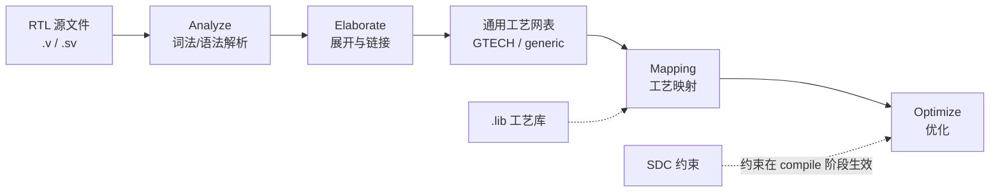

# 2.1 RTL 解析与 Elaboration（读入与展开）

逻辑综合的第一步，是把磁盘上的 **HDL 源文件** 变成工具内部的 **已展开设计数据库**。业界常把「读入 + 语法/语义检查 + 层次展开」统称为 **Elaboration**；严格说 **Analyze（解析）** 与 **Elaborate（展开）** 在 Synopsys Design Compiler 中是两个命令，Cadence Genus 也类似，但目标一致：**得到以顶层为根的、参数已定的、generate 已展开的层次化网表（通常为通用工艺 GTECH）**。

> **范围**：ASIC 标准单元流程；工具以 Design Compiler / Fusion Compiler、Genus 为主。本章 **不涉及** 工艺映射、时序优化（属后续章节）。

---

## 1. 在综合流程中的位置



| 阶段 | 输入 | 输出（概念上） |
|------|------|----------------|
| **本章** | RTL、filelist、顶层名 | 展开后的 **GTECH 层次网表**（寄存器/组合/运算符节点） |
| 后续 | GTECH + .lib + SDC | 标准单元门级网表 |

**与仿真的区别**：仿真器也在 elaboration 时展开层次，但保留四态、延时、`initial` 等；综合 elaboration **只保留可综合语义**，忽略或报错仿真专用构造。

---

## 2. 输入与前置条件

### 2.1 源文件与 filelist

综合脚本通常通过 **filelist**（`.f`）指定：

```text
# example.f
+define+SYNTHESIS
+incdir+${RTL_ROOT}/include
${RTL_ROOT}/pkg/defs.sv
${RTL_ROOT}/rtl/top.sv
${RTL_ROOT}/rtl/sub/block_a.sv
```

| 项 | 说明 |
|----|------|
| 编译顺序 | **package / 宏定义头文件** 先于引用它们的模块 |
| `+define+` | 与 RTL 中 `` `ifdef SYNTHESIS `` 配合，剔除仅仿真代码 |
| `+incdir+` | `` `include `` 搜索路径 |
| 扩展名 | `.sv` 建议显式使用 SV 模式；`.v` 需与工具选项一致 |

### 2.2 顶层（top）与设计配置

- **顶层模块名**：`elaborate` 的参数，决定层次树的根（可多 top 项目除外）。
- **Parameter 覆盖**：在 elaboration 前/时指定，例如 `#(.WIDTH(32))`，与 RTL 实例化一致。
- **黑盒（black box）**：仅接口、无 RTL 的模块（硬宏、模拟 IP）在 elaboration 时保留为空壳，供后续链接。

### 2.3 本阶段通常不需要、但易混淆的输入

| 文件 | 何时需要 |
|------|----------|
| **SDC** | `compile` / `opt_design` 时读入；elaborate 阶段可不绑定时钟 |
| **.lib** | **Mapping** 需要；纯 elaborate 可看 GTECH 结构 |
| **UPF** | 低功耗 elaboration / power intent 专用流程 |
| **LEF/DEF** | **物理综合 / PnR**，非 RTL elaboration |

---

## 3. Analyze：解析（Parse）

**Analyze** 完成 **词法分析 + 语法分析 + 部分语义检查**，将每个编译单元存入 **设计库（design library）**。

### 3.1 工具在做什么

1. 按 filelist 顺序读取源文件  
2. 识别关键字、标识符、运算符、字面量  
3. 构建 **抽象语法树（AST）** 或等价内部表示  
4. 检查 **语法错误**（缺少分号、块不完整等）  
5. 登记 **模块声明**、package、interface（若支持）  

此时尚 **未** 做跨模块连接，也 **未** 解析 parameter 的最终值（部分常量折叠除外）。

### 3.2 命令示例

**Design Compiler / Fusion Compiler**

```tcl
# 清空旧库（脚本开头常见）
remove_design -all

# 解析 SystemVerilog / Verilog
analyze -format sverilog -recursive \
    -f ${RTL_ROOT}/scripts/syn.f

# 仅 Verilog-2001
# analyze -format verilog -f syn.f
```

**Genus**

```tcl
read_hdl -sv -f ${RTL_ROOT}/scripts/syn.f
# 旧命令别名: read_hdl -language sv
```

### 3.3 常见 Analyze 报错

| 报错类型 | 典型原因 |
|----------|----------|
| Syntax error | 缺少 `endmodule`、拼写错误、SV 特性用 Verilog 模式解析 |
| Package not found | filelist 顺序错误，`import` 的包未先 analyze |
| Duplicate module | 同名 module 在多个文件重复定义且未区分库 |
| `default_nettype none` 未连接 | 信号声明了但未驱动/未连接 |

---

## 4. Elaborate：展开（Elaboration）

**Elaborate** 在已 analyze 的模块库上，从 **指定顶层** 递归实例化，完成 **参数求值、generate 展开、端口连接**，生成 **单棵（或多配置）展开层次树**。

### 4.1 展开步骤（逻辑顺序）

```text
1. 选择顶层模块 top
2. 应用顶层 / 层次上的 parameter 覆盖
3. 递归实例化子模块（解析端口映射：按名/按序）
4. 展开 generate / genvar 循环 → 生成唯一实例路径
5. 解析 `include` 与宏（`define）的最终文本
6. 类型检查：位宽匹配、端口方向、枚举赋值
7. 建立 net / port / pin 连接关系
8. 常量传播与局部折叠（如 2+3 → 5，视工具而定）
9. 输出 GTECH（或链接前的 elaborated design）
```

### 4.2 Parameter 与 Generate

与 [01-rtl 第 6 章](../01-rtl/06-generate-and-parameters.md) 直接对应：

**Parameter 覆盖**

```tcl
# DC: elaborate 时覆盖
elaborate top -parameters "FIFO_DEPTH=32,DATA_W=128"

# 或在 RTL 实例化处已写死 #(.FIFO_DEPTH(32))
```

- 覆盖仅影响 **该次 elaboration** 生成的层次，不改源文件。
- 位宽依赖 parameter 的信号（如 `logic [ADDR_W-1:0]`）在 elaboration 时 **定宽**。

**Generate 展开**

```verilog
generate
    for (genvar i = 0; i < N; i++) begin : slice
        assign out[i] = in[i] ^ mask[i];
    end
endgenerate
```

Elaboration 后层次路径类似：`top/slice[0]`、`top/slice[1]` … — 在 schematic / GUI 中可见。  
**`genvar` 循环上界** 必须是 elaboration 时常量（parameter/localparam）。

### 4.3 端口连接与位宽

| 检查 | 说明 |
|------|------|
| 位宽不匹配 | 输入窄、输出宽可能 **零扩展/符号扩展**；隐式截断可能产生 **Lint 警告** |
| 未连接端口 | 输入悬空 → 部分工具报 **ELAB-*** / **LINT-*** |
| 多驱动 | 同一 net 多个 assign/always 驱动 → elaboration 或 check_design 报错 |
| Inout | 需符合三态/IO 建模规范 |

**ASIC 建议**：RTL 端口位宽与顶层 SDC、IO 约束一致（见 [01-rtl 模块与端口](../01-rtl/01-verilog-module-and-ports.md)）。

### 4.4 黑盒与空模块

```tcl
# DC 示例：将 RAM 宏设为黑盒
set_dont_touch [get_cells u_sram_macro]
# 或 read_verilog -netlist 只读 pin 定义
```

- Elaboration 保留 **端口列表**，内部无逻辑。  
- 后续 linking 需 **.lib / physical lib** 或 **interface timing** 模型，否则 mapping 无法估算延时。

### 4.5 命令示例

**Design Compiler**

```tcl
elaborate top
# 或带参数
# elaborate top -parameters "MODE=1"

current_design top
link          ;# 解析引用，连接子设计（常与 elaborate 联用）
```

**Genus**

```tcl
elaborate top
# read_hdl 已读入时，elaborate 从库中构建
```

### 4.6 `link` 与 `elaborate` 的关系（DC）

| 命令 | 作用 |
|------|------|
| `elaborate` | 从 RTL 库 **构建** 指定顶层的展开设计 |
| `link` | 解析设计中的 **引用**（子模块、黑盒、已加载网表），保证层次 **完整连接** |

实践脚本中常见：`elaborate` → `link` → `check_design`。未 link 的子模块可能显示为 **unresolved reference**。

---

## 5. Elaboration 后的内部表示：GTECH

解析展开完成后，综合工具内部使用 **与工艺无关的通用原语**（Generic Technology，常称 **GTECH**）：

| GTECH 类型 | 对应 RTL 概念 |
|------------|----------------|
| GTECH_FD* | 寄存器（DFF 族） |
| GTECH_MUX | 多路选择器 |
| GTECH_ADD / MULT | 算术运算 |
| GTECH_BUF / INV / AND / OR | 组合逻辑 |
| GTECH_RAM | 推断的存储器（映射前） |

**要点**：

- 此时 **还没有** 映射到 Foundry 的 `NAND2X1`、`DFFRX1` 等具体单元。  
- 可在 GUI 中查看 **elaborate 后** 的 schematic，确认层次、总线、寄存器是否与预期一致。  
- **Latch、三态、RAM** 的推断在 elaboration / 早期 compile 阶段逐步显现（详见后续 **02 推断** 章节）。

---

## 6. 检查命令：Elaboration 之后立刻做

### 6.1 `check_design`

```tcl
current_design top
check_design
check_design -multiple_designs
```

| 检查项 | 示例问题 |
|--------|----------|
| 未连接端口 | 子模块 input 悬空 |
| 多驱动 | 重复 assign |
| 无驱动输出 | output 未连接 |
| 层次不一致 | link 失败、模块缺失 |
| 引脚不存在 | 例化端口名拼写错误 |

**原则**：`check_design` 无 error 再进入 `compile`；warning 需按项目规范处理。

### 6.2 报告与调试

**Design Compiler**

```tcl
report_hierarchy
report_compile_options
set_app_var hdlin_enable_hier_naming true   ;# 层次名保留，便于 debug
```

**Genus**

```tcl
report hierarchy
report cell > cells.rpt
```

| 手段 | 用途 |
|------|------|
| `report_hierarchy` | 确认实例树、参数展开是否正确 |
| GUI schematic | 查看 bus 拆分、generate 实例 |
| `write -format ddc` | 保存 elaboration 检查点 |
| 增量 elaboration | 大设计分块 read + 顶层 elaborate |

---

## 7. RTL 写法对 Elaboration 的影响（回顾）

| RTL 问题 | Elaboration / 早期综合表现 |
|----------|---------------------------|
| `` `ifdef `` 未定义仿真宏 | 仿真专用块被读入 → 可能语法/语义错误 |
| generate 上界非常量 | Elaborate 失败 |
| package 顺序错误 | Analyze 失败 |
| `interface` 在 DUT 中 | 部分工具不支持或需特殊选项 |
| 多顶层 `module` 同文件 | 需明确 `elaborate` 目标 |
| `initial` / `#delay` | 综合忽略或 warning |

更多可综合子集见 [01-rtl/07](../01-rtl/07-synthesizable-subset.md)。

---

## 8. 典型脚本片段（ASIC）

```tcl
# ========== 环境 ==========
set RTL_F   ${PROJ_ROOT}/syn/filelist/syn.f
set TOP     chip_top

# ========== 读入与展开 ==========
remove_design -all
analyze -format sverilog -f $RTL_F
elaborate $TOP
current_design $TOP
link

# ========== Elaboration 检查 ==========
check_design
report_hierarchy -noleaf > reports/elab_hier.rpt

# ========== 保存检查点（可选）==========
write -format ddc -hierarchy -output ${PROJ_ROOT}/syn/checkpoints/${TOP}.elab.ddc

# ========== 后续：读 SDC、set_libs、compile_ultra ==========
# read_sdc ...
# set_target_library ...
# compile_ultra
```

SDC 与 `compile` 在下一章 **总览 / 约束** 中展开。

---

## 9. 常见问题 FAQ

**Q：Analyze 通过但 Elaborate 失败？**  
A：查 parameter/generate、子模块是否 analyze、顶层名是否正确、filelist 是否缺文件。

**Q：Elaborate 很慢？**  
A：超大 `generate` 展开、深层层次、巨型 array 仿真式写法；考虑参数减枝、分区 elaboration。

**Q：与形式验证的 elaboration 一样吗？**  
A：概念类似（都是层次展开），但 **语义约束**（时钟、X 传播）可能不同；勿混用未验证的 `translate_off` 区域。

**Q：Elaboration 后面积/时序报告能信吗？**  
A：未 mapping 前只有 **相对** 参考价值；签核必须以 **mapped + STA** 为准。

---

## 10. 小结

| 概念 | 记住 |
|------|------|
| **Analyze** | 单文件解析进库，语法检查 |
| **Elaborate** | 顶层展开、parameter/generate 定型、建网 |
| **GTECH** | 未映射的通用网表，用于结构检查 |
| **check_design** | Elaboration 后第一道质量门 |
| **输入** | filelist、顶层、参数；SDC/lib 主要在 compile 阶段 |

---

## 下一节

- [02 推断：寄存器、锁存器、RAM、乘法器](./02-inference.md)（待写）
- [00 逻辑综合总览](./00-synthesis-overview.md)（待写）

**延伸阅读**：[01-rtl](../01-rtl/) 全章；综合流程索引见 [02-synthesis/README.md](./README.md)。
