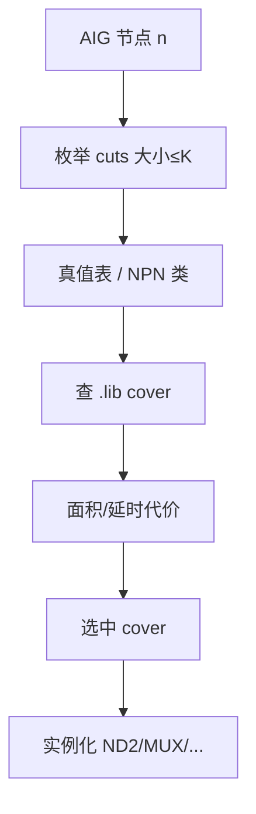

# 2.4 工艺映射（Technology Mapping）

> **本章回答**：AIG 如何绑定到标准单元库。
> **读完应能**：① 说清 cut/cover ② 解释映射 cost 含什么 ③ 知道映射后才有真实 cell delay
> **先修**：[03](./03-optimization.md) · **难度**：★★★★☆ · **walkthrough**：[mapping_walkthrough](./examples/mapping_walkthrough/)

在 **[03 粗粒度优化](./03-optimization.md)** 之后，**工艺映射（technology mapping）** 把 **AIG 上的每个逻辑锥** 和 **已推断的时序/宏资源**，换成工艺库 **`.lib` 里真实存在的标准单元**（`ND2D1`、`DFFRX1`、`CKLNQD`…）。

> 映射 = **「选哪些门、怎么拼」**；映射后网表才有 **单元延时弧**，[06](./06-timing-driven-optimization.md) 才能做 **sizing/buffer**。  
> **配套 RTL**：`examples/mapping_walkthrough/`。

---

## 1. 在流程中的位置
> **一句话**：在流程中的位置——本章核心机制点。

```text
03 优化后 AIG（AND+INV 边）
        │
        ▼
【本章】cut → cover → 选单元 → 绑定 .lib
        │
        ▼
Mapped 门级网表 + 初始 STA（WLM）
        │
        ▼
06 细粒度优化（在同一批单元上继续换型号）
```

| 阶段 | 输入 | 输出 |
|------|------|------|
| 本章 | AIG + SEQGEN 标签 + `.lib` | `*.mapped.v`、单元延时模型 |
| 06 | mapped 网表 + SDC | 换驱动/插 buffer |

### 输入/输出案例

**输入**：AIG 节点 8500；`.lib` 含 800 种组合单元

**输出**：mapped instance 计数≈6200；库单元名 `ND2D1`、`INVX1`、`MUX2D1` 等（**无 GTECH 组合**）。

---

## 2. Mapping 在解决什么问题
> **一句话**：Mapping 在解决什么问题——本章核心机制点。

| 问题 | 映射器的回答 |
|------|----------------|
| 一个 4 输入布尔函数怎么实现？ | 在库里找 **面积最小** 或 **延时最小** 的 **cover** |
| AIG 节点谁映射、谁不映射？ | 按 **PI→PO 拓扑序** 算每个节点的最优 cut；最后 **从 PO 回溯** 选 cover，被 cover 吸收的内部节点不单独映射 |
| DFF 用哪一种？ | 按 [02 推断](./02-inference.md) 选 `DFFRX*` / `DFFEQ*` |
| 乘法器呢？ | **不拆 AIG**，直接绑 `DW02_mult` 或宏 |

**核心**：组合逻辑 = **库单元覆盖布尔函数**；时序逻辑 = **查表绑单元族**。

### 输入/输出案例

**输入**（映射器面对的「问题」）：AIG 锥 `y = ¬(¬(a∧b) ∧ ¬c)`（即 `(a&b)|c`）+ `.lib` 候选 `{AN2, OR2, AO21, ND2, INV…}`

**输出（映射器的「回答」）**：

| 策略 | cover |
|------|-------|
| area 优先 | 1×`AO21D1`（单单元盖整锥） |
| 库无 AO21 | `AN2D1` + `OR2D1` 两级 |

---

## 3. Liberty（.lib）— 映射的「菜单」
> **一句话**：Liberty（.lib）— 映射的「菜单」——本章核心机制点。

```text
library (slow) {
  cell (ND2D1) { area: 1.2; pin(A) ... pin(B) ... pin(Z) ... timing(...) }
  cell (INVX1) { ... }
  cell (DFFRX1) { ... ff pins ... }
}
```

| 字段 | 映射用 | STA 用 |
|------|--------|--------|
| `area` | 面积驱动 | 面积报告 |
| `cell_rise/fall` | 估 delay 选 cover | 精确时序 |
| `pin capacitance` | 负载估算 | 签核 |
| `dont_use` / `dont_touch` | 过滤候选 | — |

### 3.1 NLDM 延时查表（与 06 cell arc 衔接）

映射与 STA 共用 **同一套查表语义**：

```text
cell_delay = lookup( input_slew, output_load, cell_rise/fall table )
```

| 量 | 来源 | 04 映射 | 06 TDO |
|----|------|---------|--------|
| input_slew | 上游 pin 或默认 | 估 cut delay | 迭代更新 |
| output_load | fanout × C_pin + net C | WLM 估 | 更准估 |
| table | .lib `cell_rise`/`cell_fall` | 选 cover | upsize 换表 |

### 输入/输出案例 3.1

**单元** `ND2D1`：slew=0.05 ns，load=0.01 pF → delay≈0.08 ns；换 `ND2D4` 同条件 → delay≈0.05 ns（**06 upsize 依据**）。

### 输入/输出案例 3.2 — dont_use 过滤

**DB 策略**：库单元子集 `dont_use`（如禁 XL 单元）

**内部**：cover 枚举 **跳过** 禁用单元；若无合法 cover → mapping **报错或降级**。

---

## 4. 组合逻辑映射：算法骨架（内部）
> **一句话**：把 AIG 子图切成小块，在 .lib 里挑能盖住它的标准单元组合——像用有限款乐高拼出任意形状。
> **类比**：cut = 选一块子图；cover = 从零件库挑一组单元拼上去。

整体是 **基于 cut 的 technology mapping**（与 ABC `map` 同类）：

```text
FOR 每个 AIG 节点 n（拓扑序，从 PI 往 PO，保证 fanin 先处理）:
    1. 枚举 n 的 K-feasible cuts（K 常 = 4~6）
    2. 对每个 cut，计算 fanin 的 2^|cut| 真值表（或 canonical form）
    3. 在 .lib 中查 **匹配 cover**（单单元或多单元级联）
    4. 为每个 cut 计算 cost = f(area, delay, arrival_time) + Σ cost(fanin)
    5. 记录 n 的 **最优 cut**（DP 表项）

最后：从 PO 沿最优 cut 的 fanin **回溯**，实例化标准单元、连接 pin；
     被 cover 吸收的内部节点不再单独映射。
```



### 4.1 Cut（切割）是什么

**Cut** = 实现节点 `n` 所需的一组 **直接输入信号**（来自 PI 或已映射子节点的输出）。

```text
        a ────┐
        b ──┐ │
              AND1 ──┐
        c ──┘      │
                   AND2 ── n   ← 对 n 的一个 cut 可能是 {AND1_out, c}
        d ─────────┘           ← 另一个 cut 可能是 {a,b,c,d} 若 K 够大
```

| 参数 | 含义 |
|------|------|
| **K** | cut 最多 **K** 个输入（`map -K 6`） |
| 小 K | cover 简单，可能 **单元多、级数多** |
| 大 K | 可用 **复杂 AOI/OAI** 单单元 cover，**级数少** |

### 输入/输出案例 4.1

**AIG 节点** `n = a & b & c`（两个 AND 级联）

| cut 方案 | 输入 | 可能 cover |
|----------|------|------------|
| cut1 | `{a,b,c}` 若 K≥3 | 一个 3-input AND（若库有）或 **AND+AND** |
| cut2 | `{t_ab, c}`，`t_ab=a&b` | `ND2` + `ND2` 两级 |

**delay 模式**可能选 **单单元 3-input**；**area 模式**可能选 **两个 2-input ND2**（更小面积）。

---

### 4.2 真值表与 NPN 等价

4 输入 cut → **16 位** 真值表 → 映射到 **NPN 规范形式**（Negation-Permutation-N）：

```text
任意 4-input 函数 ──► 等价类 representative ──► 预存最优 cover 模板
```

| 好处 | 说明 |
|------|------|
| 查表快 | 库中 4-input 组合有限类 |
| 共享 | 相同类用同一 cover 模式 |

### 输入/输出案例 4.2

**函数**：`f = a ^ b`（2 输入）

**真值表**：`4'b0110`

**映射**：库中 `XOR2D1` 或 **4 个 NAND** 分解（依库与策略）。

---

### 4.3 Cover：单单元 vs 多单元

| 类型 | 例子 | 特点 |
|------|------|------|
| **单单元** | `OAI21D1` 实现 `!(a&b)|c` | 级数少、面积可能大 |
| **多单元** | 两个 `ND2D1` 级联 | 级数多、单元小 |
| **反相** | 用 INV 或 **带反相输入的 AOI** | 吸收 AIG 的 inv 边 |

**AIG 的 inv 边**：常映射到 **引脚极性** 或 **嵌入 OAI/NAND**，而不是显式 INV。

### 输入/输出案例 4.3 — `map_and_or.sv`

**RTL**：

```systemverilog
assign y = (a & b) | c;
```

**AIG（示意）**：AND → OR 结构（或 DeMorgan 全 AND）

**映射后网表（示意，工艺相关）**：

```verilog
ND2D1 U1 ( .A1(a), .A2(b), .ZN(t1) );
INVX1 U2 ( .A(t1), .Y(t2) );
OR2D1 U3 ( .A1(t2), .A2(c), .Y(y) );
// 或一个 OAI22 / 其他 cover
```

| 映射完成 | mapped 库单元分布 |
| 无 AIG 名 | 只剩库单元 |

---

### 4.4 延时驱动 vs 面积驱动

映射阶段为每个 cut 算 **arrival time**（到达时间）：

```text
arrival(n) = max( arrival(inputs) ) + cell_delay(cover)
```

| 模式 | 优化目标 |
|------|----------|
| **-timing** | 最小化 **PO 到达时间**（关键路径） |
| **-area** | 最小化 **单元总面积** |
| **-balance** | 折中 |

**Required 也参与（AT+RT 双端）**：纯 forward arrival 会对 **所有锥** 求最快——浪费面积。时序驱动映射实际是两趟：

```text
① forward：每节点每 cut 算 arrival（最快可达时间）
② backward：从 PO 的 required（period − output 预算，05 §5.1）反传
     required(fanin) = required(n) − cell_delay(cover)
③ 节点级 slack = required − arrival：
     slack < 0 区域 → 强制 delay 最优 cover
     slack ≥ 0 区域 → 在「不破坏 required」前提下选 area 最优 cover
```

这就是「映射结果关键路径上是大单元/复杂门、非关键区域是小单元」的内部来源；06 在此基础上继续微调（sizing），07 的真实 AT/RT 接管估算。

### 输入/输出案例 4.4

**同一 AIG 锥**，两种策略：

| 模式 | 单元数 | 估算 level | 关键路径 delay |
|------|--------|------------|----------------|
| area | 8 | 5 | 1.2ns |
| timing | 11 | 3 | 0.85ns |

双端模式下若该锥 required 富余（slack ≥ +0.3），引擎选 area 方案 — **「能慢则小」**；**06 章** 还会在 mapped 结果上 **继续换大号单元**，进一步降 delay。

---

### 4.5 全局映射 vs 贪心（DP）

| 算法 | 行为 |
|------|------|
| **贪心** | 每节点 **局部** 选最优 cut（基于已固定的 fanin 代价，不回头改） |
| **全局 DP** | `cost(n) = min_C( cost(cover_C) + Σ cost(fanin) )`，共享子图只映射一次 |

```text
cost(n) = min over cuts C of:
            area/delay(cover_C) + sum_{f in fanin(C)} cost(f)
```

### 输入/输出案例 4.5 — 共享 fanin

```text
      a ──┐
      b ──┼── t ──┬── n1
            └── t ──┴── n2
```

**DP**：`t` 的最优 cover **只映射一次**，fanout=2 — 与 AIG strash 一致。

---

## 5. MUX 与复杂门的映射
> **一句话**：MUX 与复杂门的映射——本章核心机制点。

### 5.1 MUX

**RTL**（`map_mux.sv`）：

```systemverilog
assign y = sel ? b : a;
```

| 映射选项 | 单元 |
|----------|------|
| 专用 `MUX2D1` | 2 数据 + select |
| AND/OR 网络 | 无 MUX 单元时 |
| 来自 AIG | 先布尔化再映射 |

### 输入/输出案例

**输入**：4 位 `y`，1 位 `sel`

**输出**：4 个 `MUX2D1` 或 4 组 NAND 网络（**mapped MUX 计数=4 或 NAND 组×4**）。

---

### 5.1b AOI/OAI 极性匹配与 pin 置换

复杂单元（AOI21、OAI22、AO222 等）是 cover 里「单单元吃多节点」的主力；选中它们要解决 **极性 + 引脚排列** 两个匹配问题：

```text
cut 真值表 ──► NPN 规范形（§4.2）──► 命中库模板（如 OAI21 类）
                                        │ 但 NPN 变换记录了：
                                        │   N：哪些输入要取反、输出是否取反
                                        │   P：输入顺序如何置换
                                        ▼
                          回放变换 → 具体 pin 绑定方案
```

| 匹配步骤 | 内部动作 |
|----------|----------|
| **输入取反** | AIG inv 边与单元 **固有反相**（NAND/NOR/AOI 自带输出反相）对消；剩余的反相用 INV 或换极性变体单元 |
| **Pin 置换** | AOI21 的 A1/A2（AND 组）与 B（直通）**电气不对称**（内部晶体管栈位置不同 → arc delay 不同）：关键信号绑到 **快 pin**（06 §2.6 pin swap 是同一自由度的映射后再利用） |
| **输出反相** | 输出 inv 边 → 优先级联到下游单元的输入反相，最后才插 INV |

**为何 OAI21 优于 OR+NAND 两级**：单 CMOS 级（一个栅栏堆叠）实现 `!((a|b)&c)` — 比两级单元 **少一次完整摆幅翻转**，delay 和功耗都省；代价是输入电容更大、驱动更弱（栈深限制）— 这就是库中 AOI/OAI 只做到 222 左右的原因。

### 输入/输出案例 5.1b

**Cut 函数**：`y = ~((a & b) | c)`，AIG 上 c 带 inv 边。

| 候选 cover | 级数 | 反相处理 |
|------------|------|----------|
| AND + NOR | 2 | c 的 inv 需显式 INV → 3 单元 |
| **OAI21**（pin: A1=a, A2=b, B=~c？） | 1 | OAI21 实现 `~((A1&A2)|B)`… 真值表比对后 **B 绑 c 原线即可**，inv 边被输出反相对消 |

NPN 回放确定最终绑定：1 个单元、0 个额外 INV — 这类「反相吸收」正是 §4.3 表中 inv 边不显式出现的机制。

### 5.2 XOR 链（`map_xor_chain.sv`）

**RTL**：`p = a^b; q = p^c;`

| 阶段 | 结构 |
|------|------|
| AIG | 两层 XOR 分解为 AND/INV |
| 映射 | 2×`XOR2D1` **或** 8~12 个 NAND（依库） |

### 输入/输出案例

**输入**：库无 XOR 单元

**输出**：XOR 函数用 **NAND 仅** 实现 — 面积↑、级数↑。

---

### 5.3 AOI / OAI / OA：为何工艺库爱用「复杂门」

标准单元库不只有 `AND2`、`ND2`，还有大量 **复合门**，把多级逻辑 **压进一个物理单元**：

| 类型 | 布尔形式（示意） | 典型单元名 |
|------|------------------|------------|
| **AOI** | `!(A & B & … \| C & …)` | `AOI21`、`AOI222` |
| **OAI** | `!(A \| B \| … & C & …)` | `OAI21`、`OAI22` |
| **OA** | `(A & B) \| C` | `OA21` |
| **AO** | `(A \| B) & C` | `AO21` |

数字 `21`、`222` 表示 **输入分组**（如 `OAI21` = 2 个 OR 输入 + 1 个 AND 输入）。

#### DeMorgan 与 AIG 反相边

AIG 只有 AND + **反相边**。映射器常把反相 **吃进** 复合门引脚，而不是单独挂 `INVX1`：

```text
RTL:  y = !(a & b) | c

朴素映射:  ND2(a,b) → INV → OR2(·,c)     → 3 个单元

吸收反相:  OAI21( a, b, c )             → 1 个单元（极性在引脚定义里）
```

| 步骤 | 输入 | 输出 |
|------|------|------|
| AIG | `n` 带 inv 边连 `a` | 映射器查 **带反相输入** 的 OAI/AOI |
| 结果 | 同功能 | **少 1～2 个单元、少 1 级** |

#### 输入/输出案例 5.3 — `f = !(a&b)|c`

**真值表**（3 输入，8 行）→ NPN 类 → 库中匹配 `OAI21D1`：

```verilog
OAI21D1 U1 ( .A1(a), .A2(b), .B(c), .Y(y) );
// 引脚极性以 .lib 为准；Y 已实现所需反相
```

**对比 NAND 分解**：可能需 `ND2`+`INV`+`OR2` — **面积与延时** 在映射代价函数中劣于单 OAI。

#### 输入/输出案例 5.3b — MUX 与 OAI

`y = sel ? b : a` 可写成 `!(sel & !a | !sel & b)` 一类形式 → 有时 **一个 OAI22/AOI22** 覆盖一位，比 4 门 AND/OR 更省。

---

### 5.4 手写 genlib + ABC `map`（理解 cover 从哪来）

工业用 **Liberty .lib**；教学常用 **genlib**（文本门库）配合 ABC：

```text
GATE  ND2   2  1.0  AND2:   A=a, B=b, Z=z
GATE  INV   1  0.5  INV:    A=a, Z=z
GATE  OAI21 3  1.4  OAI21:  A=a, B=b, C=c, Z=z
```

| 字段 | 含义 |
|------|------|
| 第 3 列 | 输入数 |
| 第 4 列 | **面积代价**（抽象单位） |
| 最后一列 | 引脚与 **布尔原语名** |

**流程**：

```text
read_aiger design.aig
strash
map -K 6 -lib my.genlib
write_verilog mapped.v
```

映射器对 cut 算真值表 → 在 genlib 里选 **面积和 ≤ 当前最优** 的 GATE 行。

#### 输入/输出案例 5.4

**genlib 只有** `ND2`、`INV`（无 OAI）时，映射 `!(a&b)|c`：

```text
→ ND2 + INV + OR2（若 OR 在库）或更多 NAND
→ 单元数 ≥ 3
```

**加入 `OAI21` 行** 后，同一函数：

```text
→ 1× OAI21
→ 单元数 = 1（面积可能仍优于 3 个小门之和）
```

配套文件：`examples/mapping_walkthrough/demo.genlib`、`run_abc_map.sh`。

#### 与 Liberty 的关系

| | genlib | .lib |
|---|--------|------|
| 用途 | ABC 教学、算法验证 | DC/Genus/PT 生产 |
| 延时 | 常仅面积或单位延时 | 全 PVT、弧、负载 |
| 复合门 | 手写几行即可 | Foundry 提供完整库 |

---

## 6. 时序元件映射（非 AIG 路径）
> **一句话**：时序元件映射（非 AIG 路径）——本章核心机制点。

时序元件 **不经过 cut enumeration**，按 [02 推断](./02-inference.md) **查表**：

```text
GTECH_SEQGEN + 属性 ──► 选 DFF 族 ──► 连接 .CK .D .Q .RN .E
```

| 推断属性 | 典型单元 |
|----------|----------|
| async reset low | `DFFRX*` |
| sync only | `DFFX*` |
| clock enable | `DFFEQ*` / `EDFF*` |
| scan | `SDFFRQ*` |

### 6.1 SEQGEN → .lib pin 映射规则

| GTECH SEQGEN pin | .lib DFF pin | 内部动作 |
|------------------|--------------|----------|
| CK | CK / CP | 直连 clock net |
| D | D | 数据 |
| Q | Q | 输出 |
| RN / SN | RN / SN | async reset/set 极性 **须与推断一致** |
| E / EN | E 或 D 前 MUX | 无 E 脚时 **D 端插入 MUX2** |

### 输入/输出案例 6.1

**输入**：

```systemverilog
always_ff @(posedge clk or negedge rst_n)
  if (!rst_n) q <= '0;
  else if (en) q <= d;
```

**输出实例**（库中 `DFFRX*` 为异步复位 DFF，**无 enable 脚** — D 前插回环 MUX）：

```verilog
MUX2D1 u_en  ( .I0(q), .I1(d), .S(en), .Z(d_mux) );   // en=0 保持，en=1 载入
DFFRX2 u_reg ( .CK(clk), .RN(rst_n), .D(d_mux), .Q(q) );
```

| 库情况 | 映射结果 |
|--------|----------|
| 有带 enable 的 `DFFEQ*` / `EDFF*` 族 | 直接绑，`en` 接 `.E` 脚 |
| 仅普通 `DFFRX*` | 如上 **D 前插 MUX2** 实现 enable |

---

## 7. 算术与宏：绕过组合 mapping
> **一句话**：算术与宏：绕过组合 mapping——本章核心机制点。

| 资源 | 映射方式 |
|------|----------|
| `GTECH_MULT` | `DW02_mult` / 门级 Wallace 树（策略） |
| `GTECH_RAM` | SRAM 宏 / 寄存器阵（02 策略） |
| 黑盒 | `.lib` interface only |

**原则**：宽乘法、RAM **不在 AIG 上做 cut**，避免爆炸。

### 输入/输出案例

**输入**：16×16 乘法，`set_implementation DW`

**输出**：网表一个 `DW02_mult` 实例，内部 **不展开** 给用户看。

---

## 8. ABC `map` 与商业工具对照
> **一句话**：ABC `map` 与商业工具对照——本章核心机制点。

```text
abc 流程:
  strash → rewrite → balance → map -K 6 -lib genlib.lib
```

| ABC | DC / Genus |
|-----|------------|
| `map -K` | `compile` 内 mapping phase |
| `genlib` | `.lib` liberty |
| `*.aig` | 内部 DB |

### 输入/输出案例 — 可复现

```bash
yosys -p "read_verilog map_and_or.sv; hierarchy; proc; opt; abc -g AND -K 6; write_verilog out.v"
```

**输入**：`map_and_or.sv`

**输出**：`out.v` 仅含 `$_AND_`、`$_NOT_` 等 generic 单元 — 演示 **K=6 cut mapping** 的绑定逻辑；要得到商业 `.lib` 标准单元，还需 `techmap`/`abc -liberty` 一步。

---

## 9. 约束如何改变 mapping（内部）
> **一句话**：约束如何改变 mapping（内部）——本章核心机制点。

SDC 编译进 timing graph 后，**04 的 cut cost** 读取 **AT / required** 与 **面积权重**（cost 公式 `α·area + β·delay(AT)` 的主文在 [05 §5.1](./05-constraints-sdc.md#5-约束--0406-的代价函数)，此处只看约束如何改变选择）：

| 约束语义（05 章） | 映射 cost 内部变化 |
|-------------------|---------------------|
| 更紧 clock period | β·delay 权重 ↑ → 选 **浅 cover / 大驱动** |
| max_area 策略 | α·area 权重 ↑ → 选 **小 cover / 多级 ND2** |
| dont_use 单元集 | cover 搜索空间 **删边** |
| max_transition limit | 初映射倾向 **更强驱动** cover |

映射用 **WLM** 估 net delay；**06** 用同一图上的 slack 再修。

### 输入/输出案例 9.1 — 周期收紧

**内部**：period 1.0→0.5 ns，同一 AIG 上 cut 选择从「双 ND2」变为「单 OAI222」→ mapped **area ↑、level ↓**。

### 输入/输出案例 9.2 — dont_use 导致无 cover

**内部**：库禁 `OAI*` 且 K=4 → 5 输入锥 **无合法 cover** → mapper **报错或降级** 为多级 ND2（area↑）。

---

## 10. 映射完成度：内部检查项
> **一句话**：映射完成度：内部检查项——本章核心机制点。

映射 pass 结束时，DB 应满足：

| 检查项 | 通过标准 | 失败含义 |
|--------|----------|----------|
| 无 GTECH 组合 | 组合锥仅 **库单元** | mapping **未完成** |
| SEQ 已 bind | DFF/LATCH 为 `.lib` 名 | 时序元件映射漏跑 |
| 黑盒/宏 | `dont_touch` 仍在 | 正常 |
| 初版 WNS | 可负 | 预期交给 **06** |

### 输入/输出案例 10.1

**失败 DB**：仍含 `GTECH_MUX` → 04 pass **未覆盖** 该锥。  
**成功 DB**：组合仅 `ND2D1`、`INVX1` 等；timing graph 已可 **标注 cell arc**。

---

## 11. 案例集锦（逐步理解 Mapping）
> **一句话**：案例集锦（逐步理解 Mapping）——本章核心机制点。

### 案例 A：`y = (a&b)|c` 端到端

| 步 | 形态 |
|----|------|
| RTL | 1 行 assign |
| 03 AIG | ~3–5 个 AND 节点 |
| 04 map | 2–4 个标准单元 |
| 06 | 可能 upsize `ND2` → `ND2D4` |

### 案例 B：cut 大小 K 如何改变 cover

通用规律（任意 5 输入锥 `f(a,b,c,d,e)`）：

| K | cover 形态 |
|---|---------------------------|
| 4 | cut 盖不住整锥，必须 **分级**，更多级联 |
| 6 | 整锥进一个 cut，可能 **单复杂门**（OAI/AOI）cover，1 级 |

对照 `map_xor_chain.sv`（3 输入锥 `q = a^b^c`）：K=2 时只能 2×`XOR2` 级联；K≥3 时整锥一个 cut，库有 `XOR3` 则单单元。

### 案例 C：面积 vs 时序 cover 选择

```text
        ┌─ ND2 ─ ND2 ─ ND2 ─┐  area 优
  PO ───┤                  ├─
        └─ OAI222 ─────────┘  timing 优
```

### 案例 D：INV 边吸收

**AIG**：`n = !(a & b)` 带 inv 边

**映射**：一个 `OAI21`（输入极性）而非 `AND` + `INV` 两个单元 — **省面积**。

### 案例 E：寄存器不在 AIG 里

```text
[PI] ──► 组合 AIG ──► [DFF.D]
                         [DFF.Q] ──► 下一段组合 AIG
```

映射 **分段**：组合块 map；DFF **直接绑单元**。

### 案例 F：映射 vs 06

| 操作 | 章节 | 改变 |
|------|------|------|
| 换 cover 结构 | 04 | 单元 **类型** 变 |
| 同类型换驱动 | 06 | `ND2D1`→`ND2D4` |
| 插 buffer | 06 | 增实例 |

### 案例 G：常见失败

| 现象 | 原因 |
|------|------|
| 无 cover | 函数需 5 输入但 K=4 且库无大单元 |
| 用了禁用的单元 | `dont_use` 过严 |
| 映射后 area 爆炸 | XOR/乘法被拆成门阵 |

---

## 12. 案例自测（内部对照）
> **一句话**：案例自测（内部对照）——本章核心机制点。

对照 `examples/mapping_walkthrough/`，追踪 **AIG → cover → 单元**：

| 文件 | 应观察到 |
|------|----------|
| `map_and_or.sv` | `(a&b)|c` → 2–4 单元；INV 边可能 **吸收进 OAI**（案例 D） |
| `map_mux.sv` | MUX cover vs NAND 分解（§5） |
| `map_xor_chain.sv` | 3 输入 XOR 锥：小 K 时 2×`XOR2` 分级；K≥3 且库有 `XOR3` 时 **单单元**（案例 B） |

**K 对比**（同一 AIG）：K=4 → 更多 **ND2 级联**；K=6 → 更少级、可能更大单单元。

---


## 知识点清单（自检）

- [ ] cut enumeration 概念
- [ ] cover 选择看 delay+area
- [ ] 映射后出现 `.lib` 单元名
- [ ] 映射不等于 06 修时序
- [ ] mapping_walkthrough 一例

---

## 13. 小结
> **一句话**：小结——本章核心机制点。

| 概念 | 要点 |
|------|------|
| **Cut** | K 个输入的 fanin 集合 |
| **Cover** | 库单元实现 cut 的真值函数 |
| **代价** | 面积 / 到达时间 |
| **组合** | AIG + cut + .lib |
| **时序** | 推断 + 单元族 |
| **算术/宏** | 不走 cut |

---

## 下一节

- [05 SDC](./05-constraints-sdc.md)
- [06 细粒度优化](./06-timing-driven-optimization.md)
- [03 AIG 优化](./03-optimization.md)
- [examples/mapping_walkthrough/](./examples/mapping_walkthrough/)
