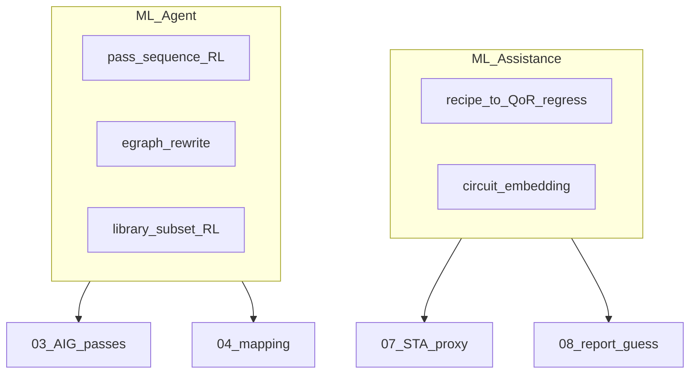
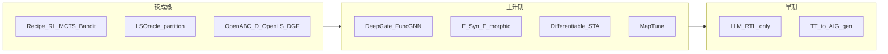

# 2.14 学术界进展与前沿 — 研究脉络与文献库

> **本章回答**：学术界在 logic synthesis 上做什么、如何对照本系列主链读论文。
> **读完应能**：① 区分 ML-Assist 与 ML-Agent ② 用主链章定位一篇论文 ③ 警惕 EPFL 与量产指标不可横比
> **先修**：[03](./03-optimization.md)–[06](./06-timing-driven-optimization.md) · **难度**：★★★☆☆（选读） · **walkthrough**：—

本章 **不描述工业工具内部实现**（见 01–13），而是把 **2019–2025 学术界逻辑综合（Logic Synthesis, LS）及相关 EDA 研究** 按本系列主链 **归档、对照、评判**：哪些工作在改 pass、哪些只做 QoR 预测、哪些在造数据集，以及它们与 [03](./03-optimization.md)、[04](./04-technology-mapping.md)、[06](./06-timing-driven-optimization.md)、[07](./07-internal-sta-and-qor.md) 的对应关系。

> **阅读前提**：已读完 **03–06**。工业签核与交付仍只看 10、13。  
> **延伸阅读**（系统综述，勿与本章重复精读）：Li et al., *A Survey of Machine Learning Approaches in Logic Synthesis*, ACM TODAES 2025 — [DOI:10.1145/3785362](https://dl.acm.org/doi/10.1145/3785362)。

---

## 1. 学术界在解决什么
> **一句话**：学术界在解决什么——本章核心机制点。

工业综合器（DC/Genus 等）把 pass 藏在 `compile` 黑盒里；学术界则常把问题 **形式化** 为可发表、可复现的优化任务：

| 学术问题形态 | 内部对应（本系列） | 典型评价指标 |
|--------------|-------------------|--------------|
| **布尔化简 / 逻辑最小化** | 03 AIG rewrite、balance | 节点数、level、AND 计数 |
| **Technology mapping** | 04 cut/cover | 面积、延迟（映射后） |
| **Synthesis recipe / pass 序列** | 03→04 的 **策略顺序** | ADP、runtime、iso-QoR 速度 |
| **Gate sizing / buffering** | 06 transform | WNS/TNS、面积、功耗 |
| **QoR 预测（不直接改网表）** | 07/08 报告量 | MAPE、排序相关、early guidance |
| **等价性 / 验证** | 10 LEC | proof rate、反例长度 |

```text
           学术常见切法                    工业黑盒 compile
  ┌─────────────────────────┐         ┌─────────────────────────┐
  │ 公开 benchmark (EPFL…)   │         │ 专有 RTL + 全 corner MCMM │
  │ 组合/小规模 sequential   │         │ 层次 + UPF + DFT + LEC    │
  │ 开源 flow (ABC/Yosys)    │         │ SVF + 增量 ECO + signoff  │
  └─────────────────────────┘         └─────────────────────────┘
              │                                    │
              └────────── 指标不可直接横比 ──────┘
```

**核心张力**：论文常在 **EPFL/MCNC 组合锥** 或 **ABC 脚本序列** 上赢 5%–30% ADP；量产关心 **端到端 closure、可重现 manifest、LEC/DFT 不破坏**（[13](./13-deliverables-and-handoff.md)）——二者评估维度 **部分重叠、部分正交**。

---

## 2. 双轴分类：ML-Assistance vs ML-Agent
> **一句话**：双轴分类：ML-Assistance vs ML-Agent——本章核心机制点。

[TODAES'25 综述](https://dl.acm.org/doi/10.1145/3785362) 将 ML 用于 LS 的工作分为两类——本系列用 **是否改动 Design DB 网表** 来对齐：

| 类型 | 学术定义 | 本系列判定 | 典型代表 |
|------|----------|------------|----------|
| **ML-Assistance** | 预测 PPA/QoR，降低仿真/综合次数 | **不改** AIG/门级拓扑 | OpenABC-D GCN、DeepGate 嵌入、GRANNITE |
| **ML-Agent** | 替代或编排启发式 pass | **改** IR 或 **选** pass 序列 | DRiLLS、AlphaSyn、MapTune、E-Syn |



### 2.1 按主链阶段的研究地图（2020–2025）

| 本系列章 | 学术热点 | 主类型 | 成熟度 |
|----------|----------|--------|--------|
| 01–02 前端 | LLM **NL→RTL**、HLS+AI | Assist（生成） | 演示多、签核少 |
| **03 粗优化** | Recipe RL/MCTS/Bandit、eq-sat | **Agent** | 最活跃 |
| **03 分析** | AIG 表示学习（DeepGate 等） | Assist | 活跃 |
| **04 映射** | MapTune、E-Syn、学习化 cover | Agent+Assist | 中上 |
| 05 约束 | ML 建议 false/multicycle | Assist | 早期 |
| **06 细优化** | GPU sizing、RL gate sizing | Agent | 竞赛驱动 |
| 07 STA | 可微 STA、GNN 延时 | Assist | 上升 |
| 10 LEC | GROOT、NN 引导 SAT | Assist+Agent | 研究型 |
| 11–13 | 跨阶段 co-opt、ECO 学习 | 混合 | 长期 |

---

## 3. 研究范式（机制视角）
> **一句话**：研究范式（机制视角）——本章核心机制点。

### 3.0 Recipe 学习时间线（2019–2025）

```text
2019  DRiLLS (DQN + ABC)                    ASP-DAC'20
  ↓
2020  Zhu et al. GCN+RL                     MLCAD'20
  ↓
2023  AlphaSyn (MCTS+NN)  ──┬── INVICTUS (offline RL+MCTS)   ICCAD'23 / arXiv'23
       RL4LS (FPGA area)   │
  ↓                        │
2024  CBTune (Syn-LinUCB) ─┘── Qian et al. 分区+并行 RL      DATE'24 / TODAES'24
  ↓
2025  PIRLLS (imitation → PPO finetune)                     ASP-DAC'25
```

**读谱系时问**：新论文是换 **算法**（RL→Bandit→MCTS）、换 **训练数据**（OpenABC-D）、还是换 **动作空间**（仅 rewrite vs 含 map/retime）？

### 3.1 Synthesis recipe 学习（ML-Agent）

**问题**：[03 §5](./03-optimization.md) 中 `strash → rewrite → balance → …` 的顺序与参数空间巨大；人工调 `abc -script` 是经验活。

**形式化**：

```text
状态 s_k  =  AIG 统计特征 + 历史 pass 轨迹（+ GNN 嵌入，若用 Zhu/DeepGate）
动作 a_k  =  {rewrite, refactor, balance, &resyn, …} 或 STOP
奖励 r_k  =  −ADP  |  −area@delay_bound  |  −node_count
```

| 代表工作 | 算法 | 机制要点 | 对应章 |
|----------|------|----------|--------|
| **DRiLLS** | 深度 RL (DQN/PPO 类) | ABC 上逐步选优化动作 | 03 §5 调度 |
| **Zhu et al.** MLCAD'20 | GCN + RL | 图卷积编码 AIG 再决策 | 03 |
| **AlphaSyn** ICCAD'23 | MCTS + NN | NN 给 policy prior 与长期回报估计 | 03 外层搜索 |
| **CBTune** DATE'24 | Contextual bandit (Syn-LinUCB) | 分步 bandit + return-back 防局部最优 | 03 recipe |
| **INVICTUS** arXiv'23 | 离线 RL + MCTS + OOD | 历史设计预训练；新设计 agent 引导搜索 | 03→04 策略 |
| **AISYN** arXiv'23 | Q-learning rewrite | 单 pass 内学习 rewrite 策略 | 03 |
| **RL4LS** ASP-DAC'23 | RL | FPGA 面积驱动 LS | 03–04（FPGA 映射） |
| **PIRLLS** ASP-DAC'25 | 模仿学习 → PPO | 专家轨迹预训练再 RL 微调 | 03 |
| **BOiLS** | Bayesian optimization | 把 recipe 当连续/结构化超参搜索 | 03 DSE |

**分析**：此类工作 **不改变单 pass 的布尔正确性**，只改 **探索顺序**——与工业 `compile` 迭代同层。弱点：训练分布多为 **ISCAS/EPFL + ABC**；对 **mapped 网表 + MCMM** 泛化证据不足。

### 3.2 大规模电路：分区与两阶段学习

| 工作 | 机制 | 与本系列 |
|------|------|----------|
| **Qian et al.** TODAES'24 / arXiv:2403.17395 | 电路 **分区** + 分区并行 RL 优化 | 类似 11 分块，但学术上常忽略 abstract/LEC |
| **PIRLLS** | 大规模训练集预训练 + 目标电路微调 | 贴近「历史项目库 → 新项目」工业形态 |

**输出判读**：分区减少 RL 状态空间，但 **割边** 可能破坏全局 strash/共享——读论文看割边对 QoR 的影响是否单独报告。

### 3.3a 电路表示学习（ML-Assistance → 可喂 Agent）

在 AIG/门级图上学习 **门嵌入**，供下游预测或 RL 状态编码：

| 工作 | 监督信号 | 机制 | 对应章 |
|------|----------|------|--------|
| **DeepGate** DAC'22 | 信号概率 | AIG 上 GNN 功能感知嵌入 | 03 特征 |
| **DeepGate2** ICCAD'23 | 真值表 / 功能 | 更高效单轮 GNN | 03 |
| **DeepGate3** ICCAD'24 | 多任务 + Transformer | GNN+Transformer 扩 subcircuit | 03 |
| **FuncGNN** TRETS'25 | 概率 / TT 距离 | 混合聚合 + 门感知归一化 | 03 分析 |
| **MGVGA** arXiv'25 | 掩码自编码 | 约束变分图自编码器 | 03 预训练 |
| **GAMORA** | 多任务 | 结构+功能门级识别 | 02/03 边界 |
| **HOGA** | Hop-aware | 大图可扩展聚合 | 03 |

**与工业关系**：嵌入 **不直接改网表**；可接入 recipe Agent 的 `s_k`，或做 congestion/功耗等 **Assist** 任务（TODAES 综述 §Boolean analysis）。

### 3.3b QoR 代理与综合仿真器（ML-Assistance）

**问题**：完整跑 ABC recipe 太慢；希望 `f(AIG, recipe) ≈ QoR`。

| 工作 | 输入 | 输出 | 对应章 |
|------|------|------|--------|
| **OpenABC-D** baseline | AIG 图 + recipe 序列 | node / delay / area（映射后） | 07/08 **代理** |
| **LSTM recipe→QoR** (TODAES 引用) | recipe 时间序列 | QoR 回归 | 08 早期预估 |
| **SynE / SynP** 类 | AIG + recipe | 节点/面积/延时 emulate | 同左 |
| **分类式超参** (TODAES [38]) | 电路特征 | 预测最优参数 **类** | 03 策略推荐 |

| 任务 | 是否改网表 | 风险 |
|------|------------|------|
| recipe→QoR 回归 | 否 | 代理偏差 → **错误 recipe 排序** |
| 跨设计迁移 | 否 | train/test 设计泄漏则指标虚高 |

### 3.4 数据集与基准（研究基础设施）

| 数据集 | 规模（量级） | 内容 | 主要用途 |
|--------|--------------|------|----------|
| **EPFL** combinational | 数十锥 | 算术/控制 AIG | LS 论文 **测试集标配** |
| **MCNC** | 经典门级 | 老 benchmark | 与 EPFL 并列出现 |
| **OpenABC-D** | ~87 万 AIG | 29 IP × 1500 recipe；图+QoR 标签 | GNN、QoR 预测、recipe 学习 |
| **OpenLS-DGF** | ~96 万+ 电路 | Verilog/GraphML 自适应生成 | 分类、QoR、recipe（TCAD'25） |
| **ISCAS / ITC / IWLS** | 多样 | 训练集常用（PIRLLS 等） | 注意与 EPFL **同源泄漏** |

**OpenABC-D 字段（读论文用）**：

```text
设计 D + recipe R  →  AIG 图 G
标签：|nodes|、delay（NanGate45 映射后）、area、recipe 步骤序列
```

**OpenLS-DGF vs OpenABC-D**：前者强调 **自适应生成** 与 Verilog 级多样性；后者强调 **真实 IP + 固定 ABC recipe 空间**——复现时须对齐工具版本（ABC commit）。

### 3.5 GPU、可微 STA 与物理交界

| 方向 | 代表 | 机制 | 对应章 |
|------|------|------|--------|
| **可微 STA** | INSTA 等 (DAC'25) | 梯度引导 timing 修复搜索 | 06 内循环加速 |
| **GPU 逻辑变换** | NVIDIA EDA Research | batch 试 transform | 06 |
| **ICCAD'24 Contest** | ML+GPU **gate sizing** | 竞赛驱动 sizing Agent | 06 |
| **跨阶段 co-opt** | 综述 §physical | sizing+placement 联调 | 越界至 [03-pnr](../03-pnr/) |

签核仍用 **非可微** PrimeTime 类引擎（[07 §1](./07-internal-sta-and-qor.md) 边界）。

### 3.6 混合框架与 LLM 边界

**LSOracle** (ICCAD'19)：分区 + DNN **分类** AIG vs MIG 优化器 → **路由** 传统引擎（Agent 的轻量变体）。

**LLM**（ICCAD'24 专题、NSF 报告）：强在 **RTL/HLS 生成**；对 **门级 recipe、MCMM closure** 仍弱。读论文时区分：**改 IR 算法** vs **改 RTL 输入**（01）。

### 3.7 Equality saturation（E-graph 重写）

| 工作 | 机制 | 与 03 关系 |
|------|------|------------|
| **E-Syn** DAC'24 | E-graph + **工艺感知 cost** | 扩展 rewrite 搜索空间，非贪心 local rewrite |
| **E-morphic** DAC'25 | 可扩展 eq-sat 结构探索 | 03 全局优化的学术替代范式 |

工业 ABC 以 **启发式 AIG rewrite** 为主；eq-sat 提供 **完备性更强** 的等价类探索，代价是 **内存与时间**。

### 3.8 Technology mapping 的 ML

| 工作 | 类型 | 机制 | 对应章 |
|------|------|------|--------|
| **MapTune** ICCAD'24 | Agent | RL 选 **标准单元子集**（library tuning）再映射 | 04 前 `dont_use` 对偶 |
| **FuseMap** | Agent | RL / bandit 选 cell 组合 | 04 |
| **E-Syn** | Agent | eq-sat + tech-aware cost | 04 cost 函数 |
| **DeepCell** arXiv'25 | Assist | 映射后网表多视图表示；**ECO + TM** | 04/10 交界 |
| **LSOracle** | 混合 | 分区选优化器（含映射前布尔阶段） | 03–04 |

**MapTune 对照**：

| 学术对象 | 本系列 |
|----------|--------|
| RL 选子库 | 04 映射前缩小 **可用 cell 集合** |
| reward = 映射后 QoR | cover cost 的 **外层搜索** |
| vs 06 sizing | MapTune 改 **库**；06 改 **已映射 instance** |

### 3.9 Logic Learning 与精确综合（Agent，偏生成）

IWLS 2020/2022 竞赛：**从真值表（完整/不完整）生成 AIG**——属于 **电路生成** 而非优化已有 RTL。

| 与 10 LEC 边界 |
|----------------|
| 生成电路须 **功能等价** 于规格；学术常证 TT 相等，工业还须 **时序/可综合性** |
| 近似生成（IWLS'20）与 **签核** 不兼容 |

TODAES'25 单列 **Logic Learning**；本系列读者可将其视为 **03 的逆向问题**（规格→IR），而非 compile 主链 pass。

---

## 4. 开源工具与复现入口
> **一句话**：开源工具与复现入口——本章核心机制点。

| 资源 | 内容 | 典型用途 |
|------|------|----------|
| **ABC** | AIG、mapping、CEC | 03–04 试验床；recipe 论文默认后端 |
| **Yosys** | 开源综合 flow | 01–04 教学 |
| **OpenROAD** | RTL→GDS | 综合—PnR 衔接 |
| **OpenABC-D** | 数据+基线脚本 | ML 论文复现 |
| **OpenLS-DGF** | 生成框架 | 大规模训练数据 |

学术结果默认 **ABC + EPFL**；与 **06 多 corner + 05 例外** 须手动映射，不可直接等同。

---

## 5. 趋势归纳（2024–2026）
> **一句话**：趋势归纳（2024–2026）——本章核心机制点。



| 趋势 | 说明 |
|------|------|
| **recipe 算法多样化** | RL → Bandit → MCTS → 离线RL+模仿（PIRLLS） |
| **数据工程** | OpenABC-D / OpenLS-DGF 成论文标配 |
| **表示学习独立成线** | DeepGate3、FuncGNN 与 recipe 论文交叉引用增多 |
| **eq-sat 回归** | E-Syn、E-morphic 挑战纯启发式 rewrite |
| **映射层 Agent 化** | MapTune 将 ML 推进到 04 |
| **2025 前沿** | PIRLLS、DeepCell、E-morphic、GROOT（大规模 LEC 图分割） |
| **可重现性** | 开源代码+固定 ABC；工业仍看 corner 闭合 |

---

## 6. 开放问题（学术 ↔ 工业鸿沟）
> **一句话**：开放问题（学术 ↔ 工业鸿沟）——本章核心机制点。

| 鸿沟 | 学术侧 | 工业侧（本系列） |
|------|--------|------------------|
| 时序 | 组合 ADP / 单 corner | MCMM、IO、generated clock（05） |
| 层次 | 扁平 benchmark | abstract、budget（11） |
| 签核 | 少见 LEC/DFT | 10、12 硬门 |
| 泛化 | 同源 benchmark 提升 | 新工艺、ECO（13 §8） |
| 可解释性 | RL 策略黑盒 | SVF / 变换日志（10 §6） |
| 代理 STA | GNN 预测延时 | 07 内嵌 STA 与签核 PT 偏差 |

**建议**：先掌握 01–08 **确定性 pass** 再读 Agent 论文；Assist 论文则对照 **07/08 哪些量可被代理**。

---

## 7. 如何读一篇 LS 论文（对照清单）
> **一句话**：如何读一篇 LS 论文（对照清单）——本章核心机制点。

| 步骤 | 问自己 |
|------|--------|
| 1. Assist 还是 Agent？ | 改网表吗？ |
| 2. 优化对象 | 03 / 04 / 06？ |
| 3. 状态·动作·奖励 | 与 Design DB 哪字段同构？ |
| 4. 基准 | EPFL only？train/test 泄漏？ |
| 5. 基线 | `resyn2`？ABC 版本？iso-runtime？ |
| 6. 时序 | 映射后 STA 还是组合 level？ |
| 7. 开源 | 代码+OpenABC-D 能否复现？ |
| 8. 读哪章 | 见 §8 表「先读本系列」列 |
| 9. 快速摘要 | 见 **§10 论文逐篇摘要** |

---

## 8. 文献库（分表）
> **一句话**：文献库（分表）——本章核心机制点。

> 各文献 **2–4 句机制摘要** 见 [§10](#10-论文逐篇摘要)。

> 类型：**A**=ML-Assistance，**G**=ML-Agent。链接以 arXiv / ACM DL 为主。

### 8.1 综述与报告

| 文献 | 年份 | 类型 | 先读本系列 | 机制 | 链接 |
|------|------|------|------------|------|------|
| Li et al., ML in Logic Synthesis | TODAES'25 | 综述 | 03–04 | 按 LS 流程全面分类 Assist/Agent | [ACM](https://dl.acm.org/doi/10.1145/3785362) |
| NSF Workshop, AI for EDA | 2026 | 报告 | 00–14 | HLS/LLS/物理全栈 AI 愿景与挑战 | [arXiv:2601.14541](https://arxiv.org/abs/2601.14541) |

### 8.2 数据集与基准

| 文献/资源 | 年份 | 类型 | 先读本系列 | 机制 | 链接 |
|-----------|------|------|------------|------|------|
| **OpenABC-D** | 2021 | 数据 | 03,07 | IP×recipe→AIG+QoR 标签 | [arXiv:2110.11292](https://arxiv.org/abs/2110.11292) |
| **OpenLS-DGF** | TCAD'25 | 数据 | 03 | 自适应大规模电路生成 | [IEEE](https://ieeexplore.ieee.org/document/10891747) |
| EPFL combinational | 2015+ | 基准 | 03 | 算术/控制组合锥 | [EPFL](https://github.com/lsilsb/abc) |
| MCNC | 经典 | 基准 | 03 | 门级 benchmark | 各论文附录 |
| **ABC** | 持续 | 工具 | 03–04 | 优化+映射+CEC | [GitHub](https://github.com/berkeley-abc/abc) |
| **Yosys** | 持续 | 工具 | 01–04 | 开源综合 flow | [yosyshq.net](https://yosyshq.net/yosys/) |

### 8.3 逻辑优化 Recipe / Agent

| 文献 | 会议 | 类型 | 先读本系列 | 机制 | 链接 |
|------|------|------|------------|------|------|
| **DRiLLS** | ASP-DAC'20 | G | 03 §5 | 深度 RL 选 ABC 优化动作 | [IEEE](https://ieeexplore.ieee.org/document/9045160) |
| Zhu et al., GCN+RL | MLCAD'20 | G | 03 | GCN 编码 AIG + RL | MLCAD 2020 |
| **AlphaSyn** | ICCAD'23 | G | 03 | MCTS + NN policy/价值 | [IEEE](https://ieeexplore.ieee.org/document/10323747) |
| **CBTune** | DATE'24 | G | 03 | Syn-LinUCB contextual bandit | DATE 2024 |
| **INVICTUS** | arXiv'23 | G | 03 | 离线 RL + MCTS + OOD | [arXiv:2305.13164](https://arxiv.org/abs/2305.13164) |
| **AISYN** | arXiv'23 | G | 03 | Q-learning rewrite | [arXiv:2302.06415](https://arxiv.org/abs/2302.06415) |
| **RL4LS** | ASP-DAC'23 | G | 03–04 | FPGA 面积驱动 RL | ASP-DAC 2023 |
| **PIRLLS** | ASP-DAC'25 | G | 03 | 模仿学习预训练 + PPO | ASP-DAC 2025 |
| Qian et al., 分区+RL | TODAES'24 | G | 03,11 | 大规模网络分区并行优化 | [ACM](https://doi.org/10.1145/3632174) |
| **BOiLS** | DATE'21 | G | 03 | Bayesian optimization recipe | DATE 2021 |

### 8.4 电路表示学习 / 分析

| 文献 | 会议 | 类型 | 先读本系列 | 机制 | 链接 |
|------|------|------|------------|------|------|
| **DeepGate** | DAC'22 | A | 03 | 信号概率监督 AIG 嵌入 | [ACM](https://dl.acm.org/doi/10.1145/3489517.3530421) |
| **DeepGate2** | ICCAD'23 | A | 03 | 真值表监督、高效 GNN | ICCAD 2023 |
| **DeepGate3** | ICCAD'24 | A | 03 | GNN+Transformer 子电路 | ICCAD 2024 |
| **FuncGNN** | TRETS'25 | A | 03 | 功能语义混合聚合 | [ACM](https://dl.acm.org/doi/10.1145/3779445) |
| **MGVGA** | arXiv'25 | A | 03 | 掩码图自编码预训练 | [arXiv:2502.12732](https://arxiv.org/abs/2502.12732) |
| **GAMORA** | — | A | 03 | 多任务门级功能识别 | 见 TODAES 表 |
| **HOGA** | — | A | 03 | Hop-aware 大图 GNN | 见 TODAES 表 |
| **DeepCell** | arXiv'25 | A | 04,10 | 映射后网表多视图；ECO/TM | [arXiv:2502.06816](https://arxiv.org/abs/2502.06816) |

### 8.5 Technology mapping 与布尔重写

| 文献 | 会议 | 类型 | 先读本系列 | 机制 | 链接 |
|------|------|------|------------|------|------|
| **LSOracle** | ICCAD'19 | G | 03–04 | 分区 + DNN 选 AIG/MIG 引擎 | [IEEE](https://ieeexplore.ieee.org/document/8942055) |
| **MapTune** | ICCAD'24 | G | 04 | RL library tuning 后映射 | ICCAD 2024 |
| **FuseMap** | — | G | 04 | RL 选 cell 子集 | 见 TODAES |
| **E-Syn** | DAC'24 | G | 03–04 | E-graph + tech-aware cost | DAC 2024 |
| **E-morphic** | DAC'25 | G | 03 | 可扩展 eq-sat 结构探索 | DAC 2025 |

### 8.6 QoR 预测与设计空间探索

| 文献 | 会议 | 类型 | 先读本系列 | 机制 | 链接 |
|------|------|------|------------|------|------|
| OpenABC-D GCN baseline | 2021 | A | 07,08 | 图级 QoR 预测基线 | 同 OpenABC-D |
| LSTM recipe→QoR | — | A | 08 | recipe 序列回归 QoR | TODAES §5 |
| **GRANNITE** | — | A | 08,09 | 可迁移 GNN 功耗估计 | TODAES 表 |
| 分类式超参 [38] | — | A | 03 | 电路特征→最优参数类 | TODAES |
| SynE 类 emulator | 教学 | A | 07 | AIG+recipe→QoR emulate | OpenABC 生态 |

### 8.7 跨阶段、验证与物理交界

| 文献 | 会议 | 类型 | 先读本系列 | 机制 | 链接 |
|------|------|------|------------|------|------|
| **INSTA** 类可微 STA | DAC'25 | A | 06,07 | 可微 timing 引导搜索 | DAC 2025 |
| ICCAD'24 GPU sizing contest | 2024 | G | 06 | ML+GPU gate sizing | ICCAD 2024 |
| **GROOT** | ICCAD'25 | A/G | 10 | 大图 LEC 分割与边再生 | ICCAD 2025 |
| NVIDIA EDA Research | 持续 | 混合 | 06,07 | GPU EDA、LLM for chip | [nvidia.com](https://research.nvidia.com/labs/electronic-design-automation/) |

### 8.8 会议与期刊跟踪清单

| venue | 典型 LS/ML+EDA 内容 | 跟进方式 |
|-------|---------------------|----------|
| **DAC** | E-Syn、E-morphic、可微 STA、系统级 AI | 每年 6 月 proceedings |
| **ICCAD** | AlphaSyn、MapTune、DeepGate3、GROOT、竞赛 | 每年 11 月 |
| **DATE** | CBTune、BOiLS | 每年 3 月 |
| **ASP-DAC** | DRiLLS、PIRLLS、RL4LS | 每年 1 月 |
| **MLCAD** | GCN+RL、ML 专题研讨 | 与 ICCAD 同周 |
| **TODAES / TCAD** | 综述、OpenLS-DGF、分区 RL | 期刊滚动 |
| **arXiv cs.LG / cs.AR** | INVICTUS、AISYN、预印本 | 引用前核对发表版 |

检索关键词：`logic synthesis reinforcement learning`、`technology mapping machine learning`、`OpenABC`、`e-graph synthesis`、`AI for EDA survey`。

### 8.9 扩展阅读（溢出）

| 文献 | 说明 |
|------|------|
| Pasandi et al., approximate LS + ML | ICCAD'21 采样近似逻辑综合 |
| IWLS Logic Learning 竞赛 | TT→AIG 生成规格 |
| GPT4AIGChip、MG-Verilog | LLM RTL（01 入口，非 LS pass） |

---

### 输入/输出案例 8.1 — INVICTUS 式 recipe 在 IR 上意味着什么

**输入**：某组合锥 AIG，节点 12k，level 42；ABC `resyn2` 后 ADP = 1.00（归一化）。

**学术方法输出**（示意）：

| recipe 片段 | 对应本系列 pass | ADP（示意） |
|-------------|-----------------|-------------|
| `balance → rewrite → refactor` ×3 | 03 §5 | 0.92 |
| → `map` | 04 | — |
| 总 runtime | — | 0.4× 纯 MCTS |

**工业判读**：EPFL 上 ADP↓8% **≠** full-chip WNS↓8%；若动 FF 拓扑须 **10 pipeline LEC**。落地多为 **03 外层策略** 或 ABC 脚本推荐。

---

### 输入/输出案例 8.2 — OpenABC-D 式 QoR 代理

**输入**：设计 `spi` 的 AIG（OpenABC-D 中一条样本）；候选 recipe `R1=resyn2`、`R2=drills_policy`（长度各 20 步）。

| 路径 | 真实 ABC 跑完 | GCN 代理预测 |
|------|---------------|--------------|
| R1 | nodes=12k, delay=1.05 | nodes=11.8k, delay=1.03 |
| R2 | nodes=9.1k, delay=0.98 | nodes=9.5k, delay=1.01 |
| **排序** | R2 更优 | R2 更优（一致） |

**误排场景**：若代理对 **未见 recipe 长度** 外推失败，可能把 R1 排前 → DSE 浪费在差 recipe 上（Assist 风险，非功能错误）。

**本系列对照**：代理只服务 **07/08 预估** 与 recipe 搜索；**签核 WNS** 仍须真实 STA（07）与 MCMM（05、13）。

---


## 知识点清单（自检）

- [ ] ML-Assist vs ML-Agent
- [ ] recipe 时间线 2019–2025
- [ ] OpenABC-D 用途
- [ ] 读论文八步清单
- [ ] 知悉 EPFL≠量产 signoff

---

## 9. 小结
> **一句话**：小结——本章核心机制点。

| 主线 | 代表 | 对应章 |
|------|------|--------|
| Recipe Agent | DRiLLS→AlphaSyn→CBTune→INVICTUS→PIRLLS | 03 |
| 表示学习 Assist | DeepGate→DeepGate3、FuncGNN | 03 特征 |
| QoR Assist | OpenABC-D、LSTM/SynE | 07、08 |
| 映射 Agent | MapTune、E-Syn | 04 |
| Eq-sat | E-morphic | 03 搜索空间 |
| 数据 | OpenABC-D、OpenLS-DGF | 复现基础 |

读论文时用 **主链章节** 做坐标，用 **13 manifest/签核** 做现实约束；逐篇摘要见 **§10**；系统细节以 **TODAES'25 综述** 为延伸。

---

## 10. 论文逐篇摘要
> **一句话**：把 §8 分表里的论文压缩成可扫读的摘要，并标出对应本系列哪一章。

> **初学者阅读顺序**：① 先读 [03–06](./03-optimization.md) 工业主链 ② 在 [§8 分表](#8-文献库分表) 按兴趣筛 1–2 类（如 mapping / sizing）③ 本文每篇只看 **本系列对照** 一行决定是否深读 ④ 勿用 EPFL 节点数直接评判量产 QoR。

按 [§8 文献库](#8-文献库分表) 分类；每篇：**问题 → 方法 → 主要结论 → 本系列对照**。

### 10.1 综述与报告

**Li et al., ML in Logic Synthesis（TODAES'25）**  
系统综述 ML 用于逻辑综合的进展，按 LS 流程（电路生成、分析、优化、映射）分阶段归纳。核心分类：**ML-Assistance**（QoR 预测、减仿真）与 **ML-Agent**（替代启发式 pass）。总结各方法优劣、数据集与工业落地挑战，适合作为本章的 **深度延伸阅读**。

**NSF Workshop Report, AI for EDA（2026）**  
美国国家科学基金会工作坊报告，覆盖 HLS、门级综合、物理设计全栈的 AI 机遇。强调数据稀缺、跨阶段协同、可验证性与人才缺口；列举 OpenLS-DGF、INVICTUS、LSOracle 等作为 LLS 代表。偏 **战略与生态**，非单算法细节。

---

### 10.2 数据集、基准与开源工具

**OpenABC-D（Chowdhury et al., 2021）**  
对 29 个开源 IP 各跑约 1500 条 ABC 综合 recipe，得到 **~87 万** 带标签 AIG 图（节点数、映射后 area/delay 等）。成为 GNN QoR 预测与 recipe 学习的 **事实标准数据集**；附带 GCN 基线与跨设计迁移实验。

**OpenLS-DGF（Ni et al., TCAD'25）**  
自适应 **生成** Verilog/GraphML 布尔电路的框架，规模可达 **96 万+** 电路。针对「每篇论文自建小数据集」问题，支持分类、QoR 预测、recipe 学习等任务；与 OpenABC-D 互补（生成多样性 vs 真实 IP recipe 轨迹）。

**EPFL combinational benchmarks**  
Amaru 等发布的算术/控制 **组合逻辑锥** 集合（adder、multiplier、router 等），几乎每篇 LS 论文的 **测试集标配**。仅组合、规模中等，利于公平比 ADP，但 **不含工业时序/MCMM** 叙事。

**MCNC**  
经典门级 benchmark 套件，早期 LS 与映射论文常用。规模与结构偏老，仍出现于与 EPFL 并列的对比实验，复现时注意 **与新版 ABC 默认脚本** 对齐。

**ABC（Berkeley）**  
开源逻辑综合与验证工具包：AIG 优化（`&rewrite` 等）、technology mapping、CEC。学术界 recipe/映射论文的 **默认后端**；工业 DC 不等价，但机制与 [03–04](./03-optimization.md) 高度同构。

**Yosys**  
开源 RTL 综合套件（Verilog → 门级/FPGA）。覆盖 [01–04](./01-rtl-parsing-and-elaboration.md) 教学与复现；ML 论文较少直接嵌入 Yosys，多与 ABC 组合使用。

**OpenROAD（扩展阅读）**  
开源 RTL→GDS 物理实现栈。不属 LS 核心，但衔接综合输出与 [03-pnr](../03-pnr/)；跨阶段 co-optimization 论文常接 OpenROAD flow。

---

### 10.3 逻辑优化 Recipe / Agent

**DRiLLS（Hosny et al., ASP-DAC'20）**  
首个影响力较大的 **深度 RL 驱动 ABC 逻辑优化** 工作：状态为 AIG 特征，动作为选择 `rewrite/refactor/...`，奖励为 QoR 改善。在 EPFL/MCNC 上优于固定 `resyn2` 脚本，奠定 **recipe = MDP** 范式（对应 [03 §5](./03-optimization.md) 调度）。

**Zhu et al., GCN+RL（MLCAD'20）**  
用 **图卷积网络编码 AIG**，再接入 RL 策略选优化动作。相对 DRiLLS 的手工特征，引入 **结构感知状态**；说明 GNN 可作为 recipe Agent 的 `s_k` 编码器。

**AlphaSyn（Pei et al., ICCAD'23）**  
**MCTS + 神经网络**：NN 同时估计 policy prior 与长期回报，指导蒙特卡洛树搜索 synthesis recipe。在 EPFL 上相对 DRiLLS/CBTune 等 SOTA 进一步降 ADP；代表 **搜索式** 而非纯策略梯度 RL。

**CBTune（Liu et al., DATE'24）**  
将 recipe 生成建模为 **上下文多臂 bandit**：每步用 Syn-LinUCB 在 ABC transform 中选臂，配合 **return-back** 跳出局部最优。在线学习、无需大规模离线库，适合 **逐设计自适应** recipe。

**INVICTUS（arXiv'23）**  
**离线 RL 预训练 + MCTS 微调 + OOD 检测**：从历史设计库学 recipe 策略，新设计上用 agent 引导搜索；OOD 时回退纯搜索。报告最高约 30% ADP 改善与数倍加速，对应 [03→04](./04-technology-mapping.md) **外层策略对象**。

**AISYN（Pasandi et al., arXiv'23）**  
**Q-learning 驱动 logic rewriting**，再接标准 technology mapping。在工业 benchmark 上报告面积/节点数显著下降（个案高达数十%，依基准而异）。聚焦 **单 pass 内** rewrite 策略，而非全长 recipe。

**RL4LS（Zhou et al., ASP-DAC'23）**  
面向 **FPGA 面积驱动** 的逻辑综合 RL 框架，动作空间与 ASIC ABC recipe 类似但奖励侧重 LUT/面积。说明 recipe 学习 **绑定目标工艺**（FPGA vs ASIC 标准单元）。

**PIRLLS（ASP-DAC'25）**  
**两阶段**：先在多 benchmark 上用 **模仿学习** 预训练专家轨迹策略，再 **PPO 微调** 目标电路。相对纯 RL 提升样本效率与泛化，代表 2025 recipe 线 **预训练+微调** 趋势。

**Qian et al., 分区+并行 RL（TODAES'24 / arXiv:2403.17395）**  
大电路 **分区** 后对各子图并行 RL 优化，减少状态空间与墙钟时间。开源端到端框架；思想接近 [11 层次化](./11-hierarchical-block-synthesis.md)，但学术评估常忽略 abstract/LEC 锁步。

**BOiLS（Bérard et al., DATE'21）**  
用 **贝叶斯优化** 在逻辑优化 **超参/算子序列** 空间搜索，将 recipe 视为可采样的结构。样本效率高于朴素 RL 的场景有优势；属 **DSE 派** recipe 优化（[03](./03-optimization.md) 外层）。

---

### 10.4 电路表示学习 / 分析

**DeepGate（Li et al., DAC'22）**  
在 AIG 上用 GNN 学习 **门级嵌入**，以 **信号概率** 为监督实现功能感知表示。下游可用于概率预测、等价类等；**不改网表**，为 Assist/Agent 提供 `s_k` 特征（[03](./03-optimization.md)）。

**DeepGate2（Shi et al., ICCAD'23）**  
引入 **真值表/功能监督** 与更高效单轮消息传递，提升嵌入精度与训练效率。相对 DeepGate 更强调 **布尔功能** 而不仅是拓扑。

**DeepGate3（Shi et al., ICCAD'24）**  
GNN 后接 **Transformer**，用子电路 pooling 与多任务学习扩展 **大图可扩展性**。代表表示学习从「单门向量」走向 **子图级语义**。

**FuncGNN（TRETS'25）**  
针对 AIG **结构异质性与全局逻辑丢失**，提出混合特征聚合、门感知归一化与多层融合。在信号概率与真值表距离任务上优于 DeepGate 系列，训练时间更短。

**MGVGA（arXiv'25）**  
**掩码图变分自编码器** 预训练电路表示，用于 QoR 预测与逻辑等价任务。属 **自监督预训练** 路线，减轻对大量标注 QoR 的依赖。

**GAMORA（Wu et al., 见 TODAES）**  
**多任务 GNN**：同时建模电路结构与逻辑功能，服务门级识别等分析任务。偏 **Assist**，为下游 DFT/安全/优化提供特征。

**HOGA（Deng et al., 见 TODAES）**  
**Hop-aware** 消息传递与门控注意力，针对 **超大图** 的可扩展 GNN。缓解 DeepGate 系在大设计上内存与感受野不足的问题。

**DeepCell（Shi et al., arXiv'25）**  
面向 **映射后门级网表** 的 **多视图表示学习**（AIG 视图 + post-map 视图）。主打 **功能 ECO** 与 technology mapping 辅助，交界 [04](./04-technology-mapping.md) 与 [10](./10-logical-equivalence-checking.md)。

---

### 10.5 Technology mapping 与布尔重写

**LSOracle（Neto et al., ICCAD'19）**  
**分区 + DNN 分类**：为每个子电路选择 **AIG 或 MIG** 优化流再调用传统引擎。报告 7nm ASIC 流上约 6.9% ADP 改善；混合 **Agent（路由）+ 传统 pass**，可解释性较好。

**MapTune（Liu et al., ICCAD'24）**  
用 **RL 选择标准单元子集**（library tuning），再跑完整 ASIC mapping；reward 为映射后 QoR。将 ML 推进到 [04](./04-technology-mapping.md) **库约束层**，与 [06](./06-timing-driven-optimization.md) sizing 正交。

**FuseMap（见 TODAES）**  
RL/bandit 在映射阶段 **选 cell 组合或融合映射策略**，目标最小化面积或延时。与 MapTune 同属 **映射 Agent**，细节依 TODAES 引用原文。

**E-Syn（Chen et al., DAC'24）**  
基于 **E-graph equality saturation**，用 **工艺感知 cost** 引导重写与映射联合探索。相对 ABC 贪心 rewrite，搜索空间更大；挑战是 **内存与运行时间**（[03–04](./03-optimization.md)）。

**E-morphic（Chen et al., DAC'25）**  
**可扩展 eq-sat** 用于逻辑综合结构探索，改进 E-Syn 规模瓶颈。代表 2025 **非 RL 的结构性优化** 前沿，与 recipe RL 线并列。

---

### 10.6 QoR 预测与设计空间探索

**OpenABC-D GCN baseline**  
在 OpenABC-D 上用 **GCN + readout** 从 AIG 预测映射后 node/area/delay；提供 **recipe 无关** 与 **recipe 条件** 任务基线。证明跨设计迁移可行但依赖数据规模（[07–08](./07-internal-sta-and-qor.md) 代理 STA）。

**LSTM recipe→QoR（TODAES 引用）**  
将 ABC optimization 序列编码为 **时间序列**，用 LSTM 直接回归 QoR，避免逐步仿真。用于 **快速筛 recipe**；风险是长 recipe 外推与分布偏移。

**GRANNITE（TODAES 引用）**  
**GNN 功耗估计**，强调训练后可 **零样本迁移** 到新网表。属 Assist，服务 [08–09](./08-synthesis-reports.md) 功耗预估，非门级 transform。

**分类式超参（TODAES [38]）**  
把「选哪类优化参数/脚本模板」建成 **监督分类**：用电路特征预测最优 **离散配置类**，跳过昂贵搜索。适合作为 compile 策略 **推荐器**，非端到端 Agent。

**SynE / SynP 类（OpenABC 生态）**  
教学/研究用 **综合仿真器**：输入 AIG + recipe，预测 post-synthesis 节点/面积/延时，而不跑完整 ABC。与 OpenABC-D baseline 同族，说明 **emulator 辅助 DSE** 的可行性。

---

### 10.7 跨阶段、验证与物理交界

**INSTA 类可微 STA（DAC'25, NVIDIA 等）**  
构建 **可微分 STA** 引擎，使 timing 对 cell/网参数有可导近似，用梯度引导 **物理设计优化**。改变 [06–07](./06-timing-driven-optimization.md) **搜索方式**；签核仍须非可微金标准 STA。

**ICCAD'24 GPU sizing contest**  
竞赛要求用 **ML + GPU** 加速 **gate sizing** 在大型设计上收敛。代表 [06](./06-timing-driven-optimization.md) **细粒度 Agent** 的社区基准与工业算力结合。

**GROOT（Thorat et al., ICCAD'25）**  
针对大规模设计 **LEC 验证**：图 **边再生与分割** 降低 miter 规模。属 [10](./10-logical-equivalence-checking.md) **验证加速**，非综合 pass，但与综合后 signoff 强相关。

**NVIDIA EDA Research（项目集）**  
涵盖 GPU 加速 EDA、RL/LLM for chip design、可微 STA（INSTA）、RTL 仿真加速等 **多条线**。无单篇论文可概括；跟踪其主页可获知 **06–07 与 LLM** 产业研究动向。

---

### 10.8 扩展阅读摘要

**Pasandi et al., approximate LS + ML（ICCAD'21）**  
用 **可解释 ML** 指导 **近似逻辑综合** 采样：在误差约束下最小化面积/延时。面向 **容错/近似计算**，与量产 **精确签核** 路线不同。

**IWLS Logic Learning 竞赛（2020/2022）**  
从 **完整/不完整真值表** 生成 AIG 的竞赛规格。2020 允许近似，2022 要求精确；属于 **规格→电路生成**（[03 逆向](./03-optimization.md)），非 optimize 已有 RTL。

**GPT4AIGChip / MG-Verilog（LLM RTL）**  
用 **大模型 + 示例或细粒度标注数据** 生成加速器类 Verilog。影响 [01](./01-rtl-parsing-and-elaboration.md) **输入质量**，不替代 ABC recipe；签核仍须仿真与 LEC。

---

## 下一节

- [03 粗优化](./03-optimization.md)
- [04 工艺映射](./04-technology-mapping.md)
- [00 总览](./00-synthesis-overview.md)
- [DESIGN.md](./DESIGN.md)
