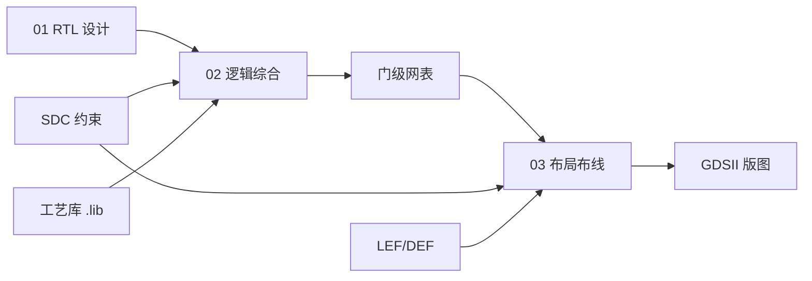

# 逻辑综合与物理设计学习文档

面向 **ASIC 数字 IC 设计** 的系统化自学路径：从 **可综合 RTL** 出发，经 **逻辑综合** 到 **布局布线（PnR）**，到 **签核（Signoff）**，并串联 Synopsys / Cadence 等主流 EDA 流程。

> **设计范围**：本文档以 **标准单元 ASIC 流片流程** 为准（RTL → 综合 → PnR → GDSII → STA/DRC/LVS 签核）。**不包含 FPGA**（无比特流、无 CLB/BRAM 推断、无 Vivado 等工具链）。

## 如何使用本文档

| 阶段 | 目录 | 前置知识 | 产出能力 |
|------|------|----------|----------|
| 0 | [00-preface](./00-preface/) | 数字电路基础 | 统一术语、了解工具链 |
| 1 | [01-rtl](./01-rtl/) | Verilog 入门更佳 | 写出可综合、可维护的 RTL |
| 2 | [02-synthesis](./02-synthesis/) | 完成 01-rtl | 理解综合报告、约束与优化 |
| 3 | [03-pnr](./03-pnr/) | 完成 02-synthesis | 理解时序收敛与物理效应 |
| 4 | [04-flow-and-tools](./04-flow-and-tools/) | 上述章节 | 跑通一条完整 EDA 流程 |
| 5 | [05-practice](./05-practice/) | 按需 | 实验、Checklist、面试题 |

建议按编号顺序阅读；每章末尾有 **小结** 与 **延伸阅读**。

## 完整目录结构

```text
docs/
├── README.md                          # 本文件：总索引与学习路径
│
├── 00-preface/                        # 前言与基础
│   ├── README.md
│   ├── glossary.md                    # 术语表（RTL、SDC、LEF/DEF…）
│   └── eda-toolchain-overview.md      # 综合 / PnR / STA 工具角色（待写）
│
├── 01-rtl/                            # ★ 当前重点：RTL 与可综合写法
│   ├── README.md
│   ├── 01-verilog-module-and-ports.md
│   ├── 02-data-types-and-operators.md
│   ├── 03-continuous-and-procedural.md
│   ├── 04-sequential-logic.md
│   ├── 05-fsm.md
│   ├── 06-generate-and-parameters.md
│   ├── 07-synthesizable-subset.md     # 可综合子集 vs 仿真专用构造
│   ├── 08-coding-guidelines.md        # 编码规范与反模式
│   ├── 09-systemverilog-vs-verilog.md # SV 与 Verilog 对比
│   └── examples/                      # 可综合示例（供仿真/综合实验）
│       └── README.md
│
├── 02-synthesis/                      # 逻辑综合（见 02/README、DESIGN）
│   ├── README.md / DESIGN.md
│   ├── 00-synthesis-overview.md
│   ├── 01-rtl-parsing-and-elaboration.md
│   ├── 02-inference.md
│   ├── 03-optimization.md
│   ├── 04-technology-mapping.md
│   ├── 05-constraints-sdc.md
│   ├── 06-timing-driven-optimization.md
│   ├── 07-synthesis-reports.md
│   ├── 08-low-power-synthesis.md
│   ├── 09-logical-equivalence-checking.md
│   ├── 10-hierarchical-block-synthesis.md
│   ├── 11-dft-and-scan.md
│   └── 12-deliverables-and-handoff.md
│
├── 03-pnr/                            # 布局布线（待展开）
│   ├── README.md
│   ├── 01-floorplan.md
│   ├── 02-placement.md
│   ├── 03-clock-tree-synthesis.md
│   ├── 04-routing.md
│   ├── 05-physical-verification.md
│   └── 06-signoff-timing.md
│
├── 04-flow-and-tools/                 # 流程与脚本（待展开）
│   ├── README.md
│   ├── Makefile-and-filelists.md
│   └── from-rtl-to-gds-flow.md
│
└── 05-practice/                       # 练习与清单（待展开）
    ├── README.md
    ├── rtl-review-checklist.md
    └── lab-ideas.md
```

## 与工业流程的对应关系



## 当前进度

- [x] 文档骨架与目录规划
- [x] **01-rtl**：RTL 语法与可综合写法（第一版）
- [x] 02-synthesis：01 RTL 解析与 Elaboration
- [x] 02-synthesis：02 推断
- [x] 02-synthesis：全章（00–12，含 LEC/DFT/交付）
- [x] 02-synthesis：**内部机制深化**（05–11 + walkthrough：sdc/tdo/power 等）
- [ ] 03-pnr：原理章节
- [ ] 可运行实验脚本（Yosys/Makefile，可选）

## 参考与约定

- **流程**：Design Compiler / Fusion Compiler（综合）→ Innovus / ICC2（PnR）→ PrimeTime（STA）等为叙述参照；不同 Foundry 的 .lib / LEF / MCMM 细节以项目为准。
- **HDL**：Verilog-2001 / SystemVerilog **可综合子集**；必要时提及 VHDL。
- 代码块默认 **可综合**；`initial`、`$display` 等仅用于仿真或 Testbench。
- 位宽、时钟域、复位策略在 RTL 阶段即应明确，避免留给综合/PnR “猜”。
- **存储器**：ASIC 中大块 SRAM 通常例化 **Memory Compiler / 硬宏**；RTL 推断的 RAM 需与工艺 RAM 单元或寄存器堆模板一致。
